# Home Automation - Safety, security and recovery strategy

## 2. System requirements

### 2.1 System boundaries

#### 2.1.1 Inside the System Boundary:

---

**Hardware sensors - Input interface:**

- windows contact sensor
- door contact sensor
- smoke detector
- gas detector
- carbon monooxide detector
- climate sensor for each room (temperature and humidity)
- inside air pollution
- boiler signals and measurements

**Cloud sensors - Input interface:**

- Weather sensor
  - Current temperature, pressure, wind speed, clouds
  - Forecast for temperature, pressure, wind speed, clouds
  - Hazardous fenoma:
    - Storm alert
    - Blizzard alert
    - Wind alert
    - Rain alert
    - Heatwave alert
    - Tornado alert
- Occupancy sensor
- Outside air pollution
- System health data and system update information
- Ethernet port status
- Link status to router
- Link status to WAN
- System latency data
- Packet loss data

**HW Actuators - Output interface:**

- Smart locks
- Siren
- Information light
- Alert light

**Cloud Actuators:**

- Phone application popup
- Main card in UI
- User action scheduler

**Processing:**

- Home automation instance

---

#### 2.1.2 Outside the System Boundary:

- The physical environment where the home is located and which the sensors are monitoring
- Users who interact with the system, either physically or through an interface/app
- Internet services providing data such as weather forecasts

#### 2.1.3 System modes:

---

**Armed Mode:**

- The system is actively monitoring for hazards and is ready to react.

**Disarmed Mode:**

- The system is not actively monitoring for hazards.

**Maintenance Mode:**

- The system checks the status of its sensors and actuators, updates its software, and performs other maintenance tasks.

TODO - Add state machine

#### 2.1.4 Interfaces requirements:

---

##### Smoke/Gas/CO sensor

    - TODO

##### Smoke/Gas/CO sensor

    - TODO

##### Window/Door contact

    - Shall support contact notification
    - Shall support remained batery value

##### House occupy

    - Sleep time - Event that notify that everyone goes to sleep
    - Leave - Home is empty less than 1 day
    - Vacation - Home is empty more than 1 day
    - Home Alone: Only one person is at home. This could adjust safety and security measures, and change other settings like temperature or lighting.
    - Guests: You have guests over. This may require different settings for privacy, security, or comfort.
    - Kids: Only not adult residents are in house.
    - Occupied: Adult residents are in house

##### Weather sensor

    - TODO

##### Weather environmental hazards:

    - Freezing - Temperature below 4 C
    - Storm - Incoming storm
    - Rain
    - Air pollution - Air pollution 2.5pmm above 20
    - Heatwave: High temperatures might require specific responses such as closing blinds, turning on air conditioning, etc.
    - High Wind: Could lead to similar responses as a storm.
    - Snow: Cold temperatures combined with snowfall might affect heating systems and require specific actions.
    - High Humidity: This might trigger dehumidifiers or other responses to control internal humidity.

##### Outside air pollution sensor

    - TODO

##### System health data and system update information

    - TODO

##### Ethernet network health:

TODO

- Ethernet port status
- Link status to router
- Link status to WAN
- System latency data
- Packet loss data

##### Heating output values

    - TODO

##### Heating input values

    - TODO

##### Smart lock actuator

    - TODO

##### Alarm siren

    - TODO

##### Informational light

    - TODO

##### Smart lock actuator

    - TODO

##### Alert light

    - TODO

##### Phone application popup

    - TODO

##### Lovelance card

    - TODO

##### User action scheduler

    - TODO

---

#### 2.1.4 Common definitions:

- Critical windows/door are elements that should be closed if nobody are in house, like front windows.
- Notifiaction levels:

|         | Description Notification                                                                                                                  |
| ------- | ----------------------------------------------------------------------------------------------------------------------------------------- |
| Level 1 | Home assistant notification on phone with higher priority, sound alarm, light notification as yellow, and dashboard information as hazard |
| Level 2 | Home assistant notification on phone with higher priority, light notification as yellow, and dashboard information as hazard              |
| Level 3 | Home assistant notification on phone and dashboard information as warning                                                                 |
| Level 4 | Dashboard information                                                                                                                     |

#### 2.1.5 System components:

---

#### **Window Monitoring Component:**

**Inputs:**

- Window contact sensor data
- Occupancy sensor data
- Room temperature sensor data
- Outside temperature data (from weather forecast)
- Rain forecast data (from weather forecast)
- Storm forecast data (from weather forecast)

**Outputs:**

- Alerts to occupants (via various channels)
- Heating system actactors

**Safety Goals Addressed:**

- The system shall ascertain the closure of critical windows in the absence of occupants, presence of minors or all occupants are asleep.
- The system shall alert the occupants if the temperature drops below a certain threshold.
- The system shall alert the occupants if the temperature rises, windows are closed, and the external temperature is lower than the room temperature.
- The system shall alert occupants if any doors or windows are open in case of a rain forecast.
- The system shall alert occupants if any doors or windows are open in case of a storm forecast.
- The system shall interface with the home heating system to mitigate cold exposure hazards.
- The system shall alert the occupants if air quality deteriorates below a predefined standard and windows are open.

**States and Transitions:**

##### SM_WMC_1 (Windows status if house empty)

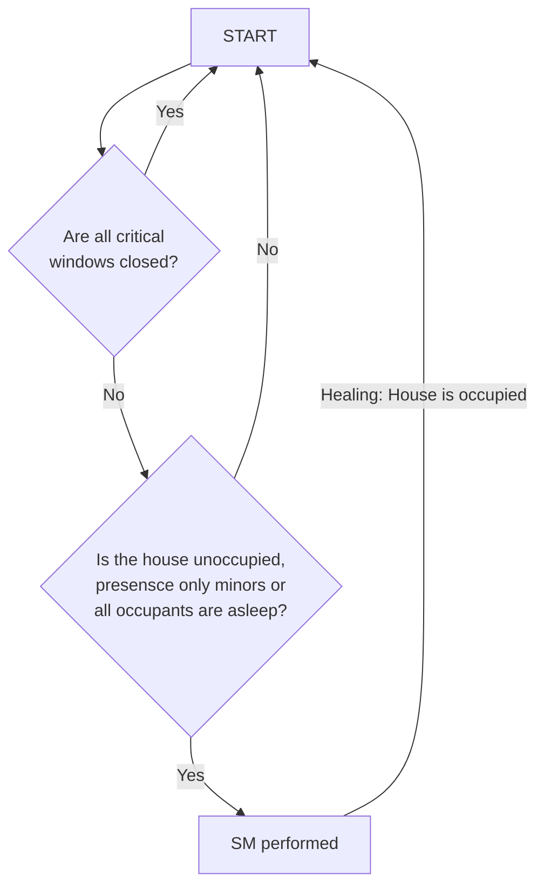
```mermaid
flowchart TD
    A[START] -->| | B{Are all critical \nwindows closed?}
    B -->|Yes| A
    B -->|No| C{Is the house unoccupied, \npresensce only minors or \nall occupants are asleep?}
    C -->|No| A
    C -->|Yes| E[SM performed]
    E -->|Healing: House is occupied| A
```

    - SM shall be realized by notification of level 2

##### SM_WMC_2 (TODO)

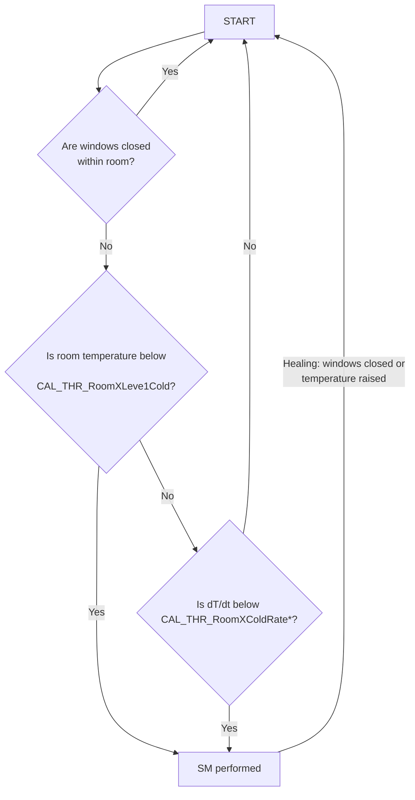
```mermaid
flowchart TD
    A[START] -->| | B{Are windows closed\n within room?}
    B -->|Yes| A
    B -->|No| C{Is room temperature below\n CAL_THR_RoomXLeve1Cold?}
    C -->|No| D{Is dT/dt below \nCAL_THR_RoomXColdRate*?}
    C -->|Yes| E[Notification on level B?]
    D -->|No| A
    D-->|Yes| E[SM performed]
    E -->|Healing: windows closed or\n temperature raised| A
```

    - SM shall be realized by notification of level 2

##### SM_WMC_3 (Window Monitoring and Temperature Control in Unoccupied Rooms)

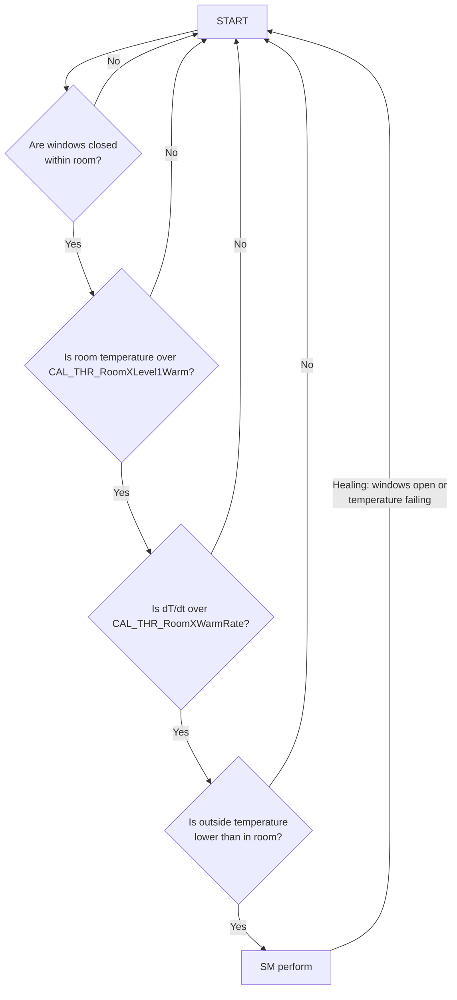
```mermaid
flowchart TD
    A[START] -->| | B{Are windows closed\n within room?}
    B -->|No| A
    B -->|Yes| C{Is room temperature over \nCAL_THR_RoomXLevel1Warm?}
    C -->|No| A
    C -->|Yes| D{Is dT/dt over \nCAL_THR_RoomXWarmRate?}
    D -->|Yes| E{Is outside temperature\n lower than in room?}
    D  -->|No| A
    E -->|No| A
    E -->|Yes| F[SM perform ]
    F -->|Healing: windows open or\n temperature failing| A
```

    - SM shall be realized by notification of level 3

##### SM_WMC_4 (Rain monitoring)

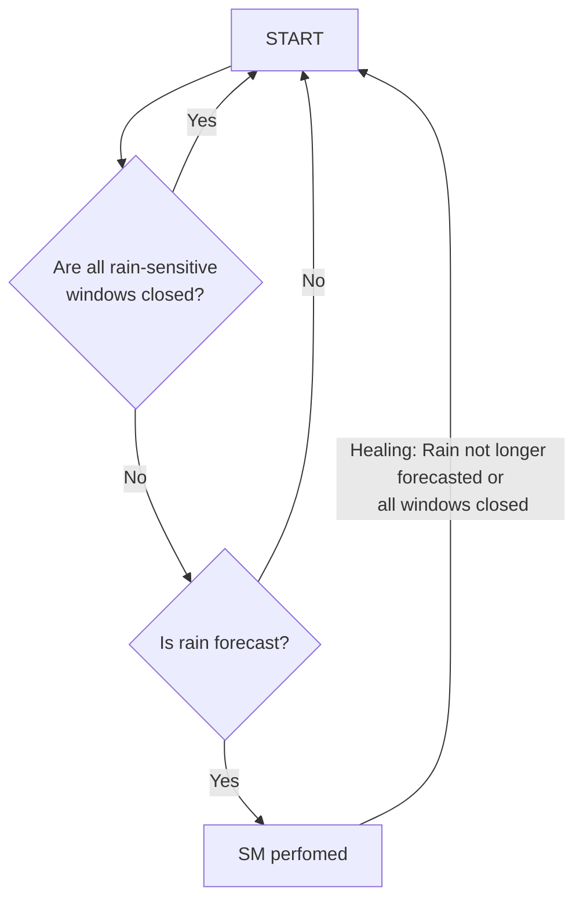
```mermaid
flowchart TD
    A[START] -->| | B{Are all rain-sensitive\n windows closed?}
    B -->|Yes| A
    B -->|No| C{Is rain forecast?}
    C -->|No| A
    C -->|Yes| E[SM perfomed]
    E -->|Healing: Rain not longer forecasted or\n all windows closed| A
```

    - SM shall be realized by notification of level 2

##### SM_WMC_5 (Storm monitoring)

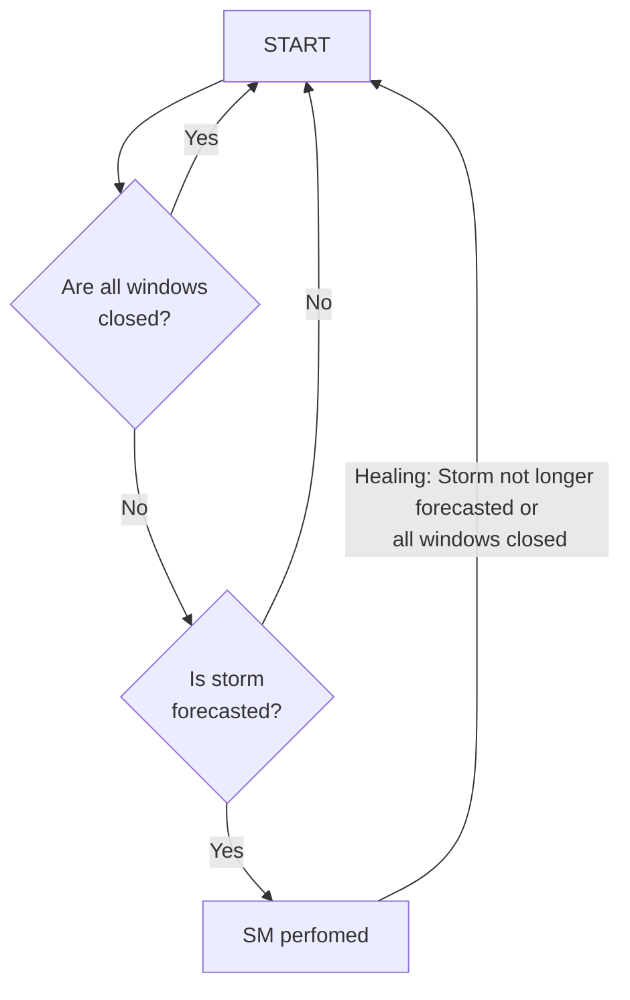
```mermaid
flowchart TD
    A[START] -->| | B{Are all windows\n closed?}
    B -->|Yes| A
    B -->|No| C{Is storm \nforecasted?}
    C -->|No| A
    C -->|Yes| E[SM perfomed]
    E -->|Healing: Storm not longer forecasted or\n all windows closed| A
```

    - SM shall be realized by notification of level 2

##### SM_WMC_6 (Level2 cold exposure)

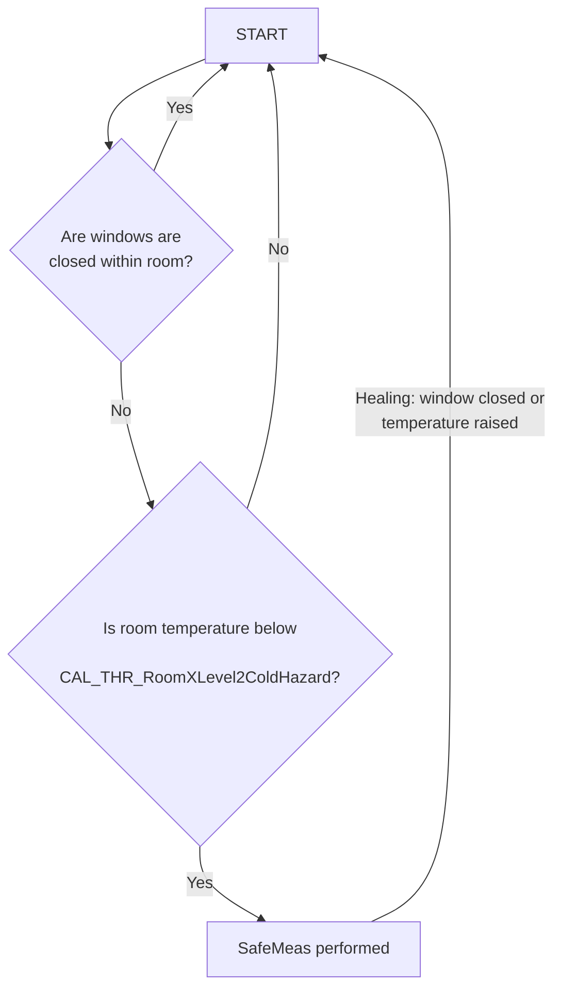
```mermaid
flowchart TD
    A[START] -->| | B{Are windows are\n closed within room?}
    B -->|Yes| A
    B -->|No| C{Is room temperature below\n CAL_THR_RoomXLevel2ColdHazard?}
    C -->|No| A
    C-->|Yes| E[SafeMeas performed]
    E -->|Healing: window closed or \ntemperature raised| A
```

    - SM shall be realized increasing setpoint value for specif room by CAL_THR_HeatingIncrease

##### SM_WMC_7 (Rain-sensitive Window Monitoring and Forecast Awareness)

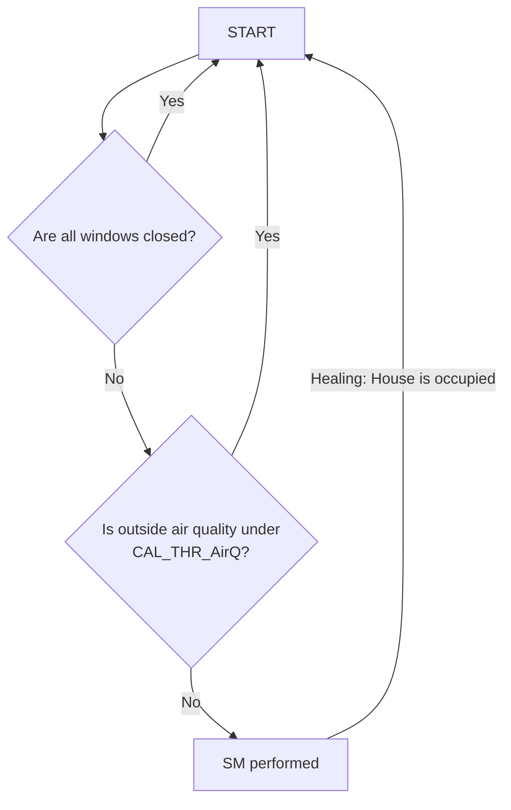
```mermaid
flowchart TD
    A[START] -->| | B{Are all windows closed?}
    B -->|Yes| A
    B -->|No| C{Is outside air quality under\n CAL_THR_AirQ?}
    C -->|Yes| A
    C -->|No| E[SM performed]
    E -->|Healing: House is occupied| A
```

    - SM shall be realized by notification of level 2

##### SM_WMC_8 (Windows Sensor Maintenance Reminder)

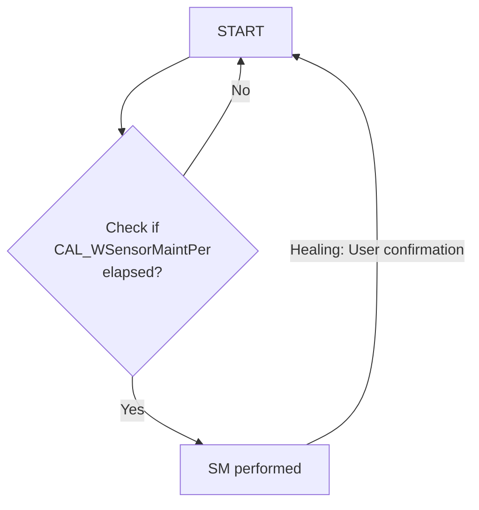
```mermaid
flowchart TD
    A[START] -->| | B{Check if \nCAL_WSensorMaintPer\n elapsed?}
    B -->|No| A
    B -->|Yes| C[SM performed]
    C -->|Healing: User confirmation| A
```

    -SM shall be realized by scheduling maintenance action for user

---

#### **Hazardous Atmosphere Detection Component:**

**Inputs:**:

- Smoke detector sensor data
- Gas detector sensor data
- Carbon monoxide detector sensor data

**Outputs:**

- Alerts to occupants
- External doors unlocked for evacuation
- Scheduler

**Safety Goals Addressed:**

- The system shall actively detect the presence of smoke.
- The system shall promptly alert the occupants in the event of a fire.
- The system shall schedule and issue reminders for maintenance of fire sensors.
- The system shall unlock external doors to expedite evacuation in case of fire.
- The system shall alert the occupants promptly upon detection of a gas leak.
- The system shall automatically disengage the main gas supply when a gas leak is detected.
- The system shall schedule and issue reminders for maintenance of gas sensors.
- The system shall alert occupants when hazardous levels of carbon monoxide are detected.
- The system shall schedule and issue reminders for maintenance of CO sensors.

##### SM_HADC_1 (Smoke Detection and Alert)

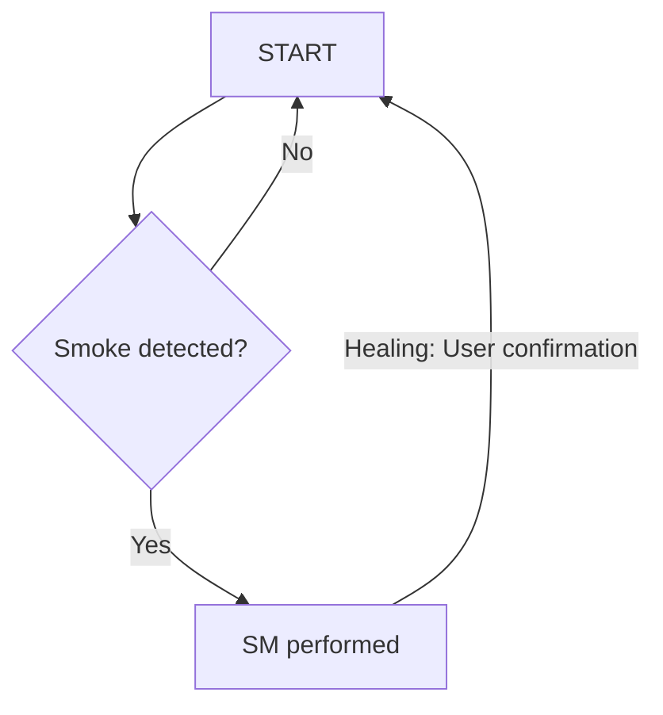
```mermaid
flowchart TD
    A[START] -->| | B{Smoke detected?}
    B -->|No| A
    B -->|Yes| C[SM performed]
    C -->|Healing: User confirmation| A
```

    -SM shall be realized by notification of level 1 and evacuation process

##### SM_HADC_2 (Gas Detection and Alert)

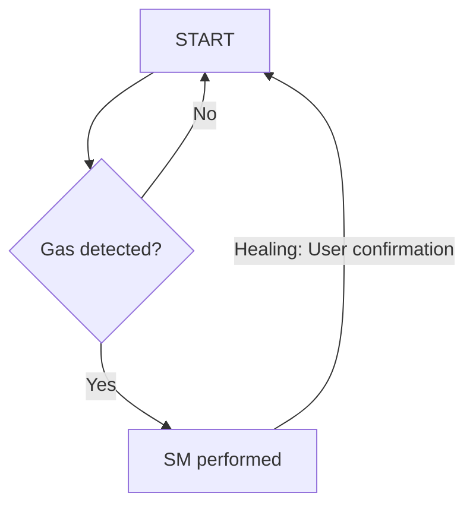
```mermaid
flowchart TD
    A[START] -->| | B{Gas detected?}
    B -->|No| A
    B -->|Yes| C[SM performed]
    C -->|Healing: User confirmation| A
```

    -SM shall be realized by notification of level 1 and evacuation process

##### SM_HADC_3 (Carbon monoxide detection and Alert)

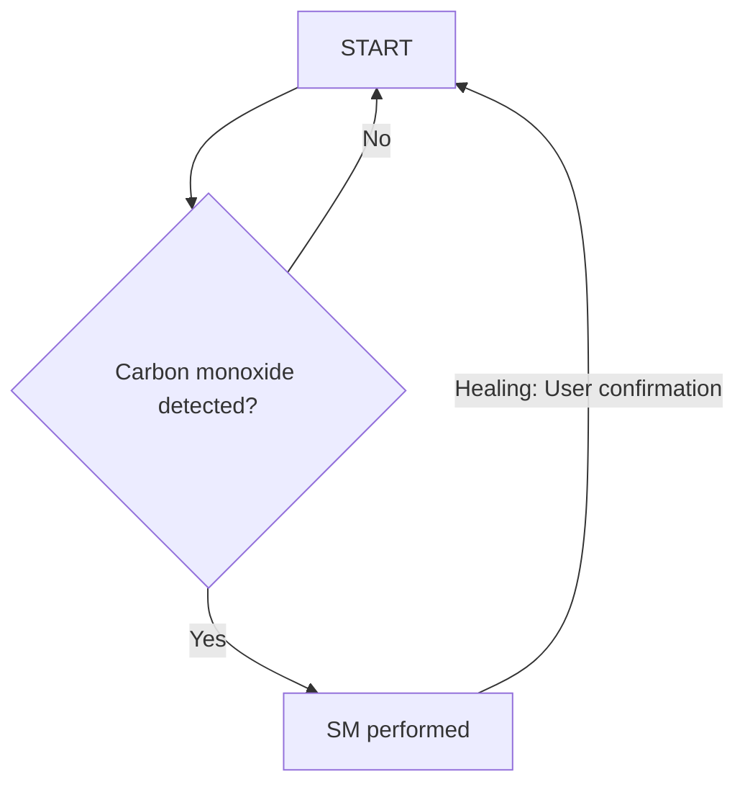
```mermaid
flowchart TD
    A[START] -->| | B{Carbon monoxide detected?}
    B -->|No| A
    B -->|Yes| C[SM performed]
    C -->|Healing: User confirmation| A
```

    -SM shall be realized by notification of level 1 and evacuation process

##### SM_HADC_4 (Gas Leak Sensor Maintenance)

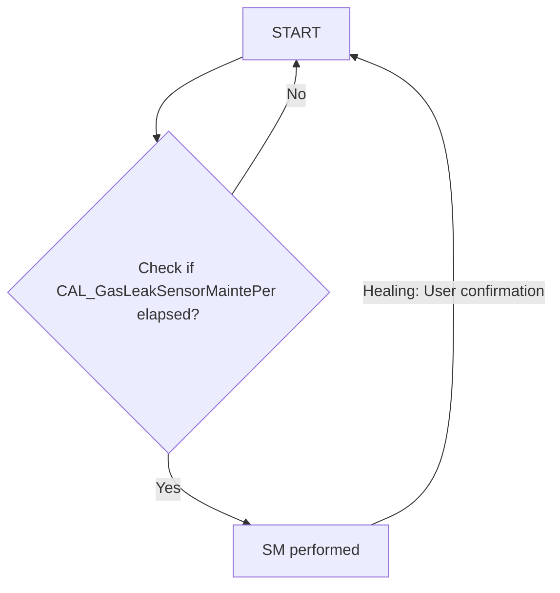
```mermaid
flowchart TD
    A[START] -->| | B{Check if \nCAL_GasLeakSensorMaintePer elapsed?}
    B -->|No| A
    B -->|Yes| C[SM performed]
    C -->|Healing: User confirmation| A
```

    -SM shall be realized by schedule maintenance action for user

##### SM_HADC_5 (Smoke Sensor Maintenance)

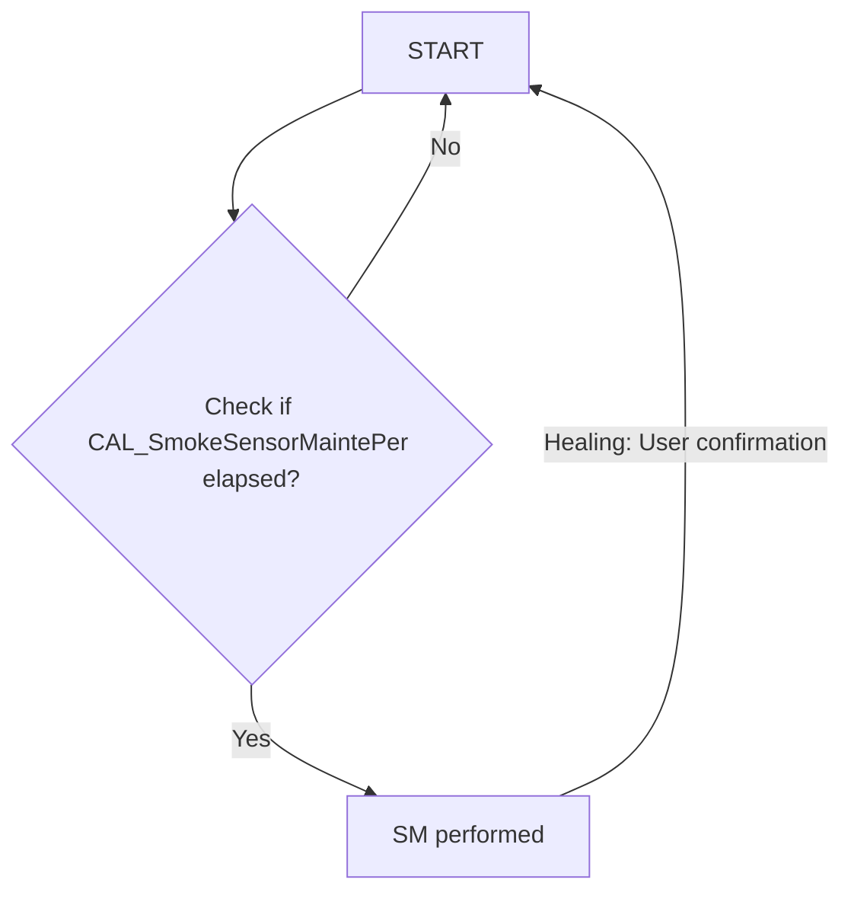
```mermaid
flowchart TD
    A[START] -->| | B{Check if \nCAL_SmokeSensorMaintePer elapsed?}
    B -->|No| A
    B -->|Yes| C[SM performed]
    C -->|Healing: User confirmation| A
```

    -SM shall be realized by schedule maintenance action for user

##### SM_HADC_6 (CO Sensor Maintenance)

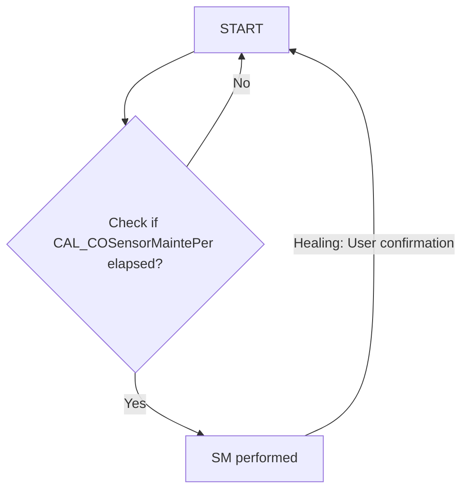
```mermaid
flowchart TD
    A[START] -->| | B{Check if \nCAL_COSensorMaintePer elapsed?}
    B -->|No| A
    B -->|Yes| C[SM performed]
    C -->|Healing: User confirmation| A
```

    -SM shall be realized by schedule maintenance action for user

#### **Door Monitoring Component:**

**Inputs:**

- Door contact sensor data
- Occupancy sensor data

**Outputs:**
-Alerts to occupants
-SmartLocks

**Safety Goals Addressed:**

- The system shall persistently monitor the status of external doors in relation to the home occupancy status.
- The system shall ensure closure of external doors within a predefined timeout interval.
- The system shall alert occupants if any doors or windows are open in case of a rain forecast.
- The system shall alert occupants if any doors or windows are open in case of a storm forecast.
- The system shall ensure external doors are locked when the house is unoccupied or all occupants are asleep.

##### SM_DMC_1 (External Door Monitoring in Absence)

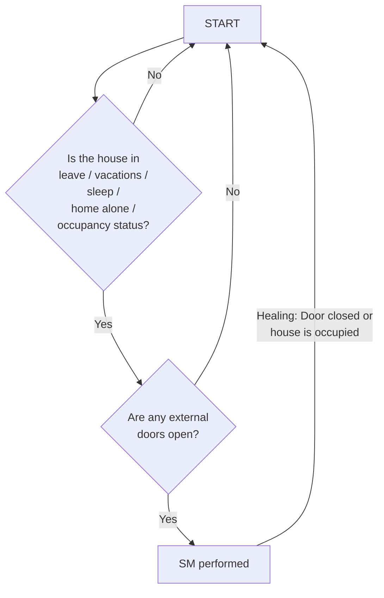
```mermaid
flowchart TD
    A[START] -->| | B{Is the house in \nleave / vacations /\n sleep /\n home alone /\n occupancy status?}
    B -->|No| A
    B -->|Yes| C{Are any external\n doors open?}
    C -->|No| A
    C -->|Yes| D[SM performed]
    D -->|Healing: Door closed or \nhouse is occupied| A
```

    -SM shall be realized by sending a notification of level 2

##### SM_DMC_2 (External Door Open Duration Monitoring)

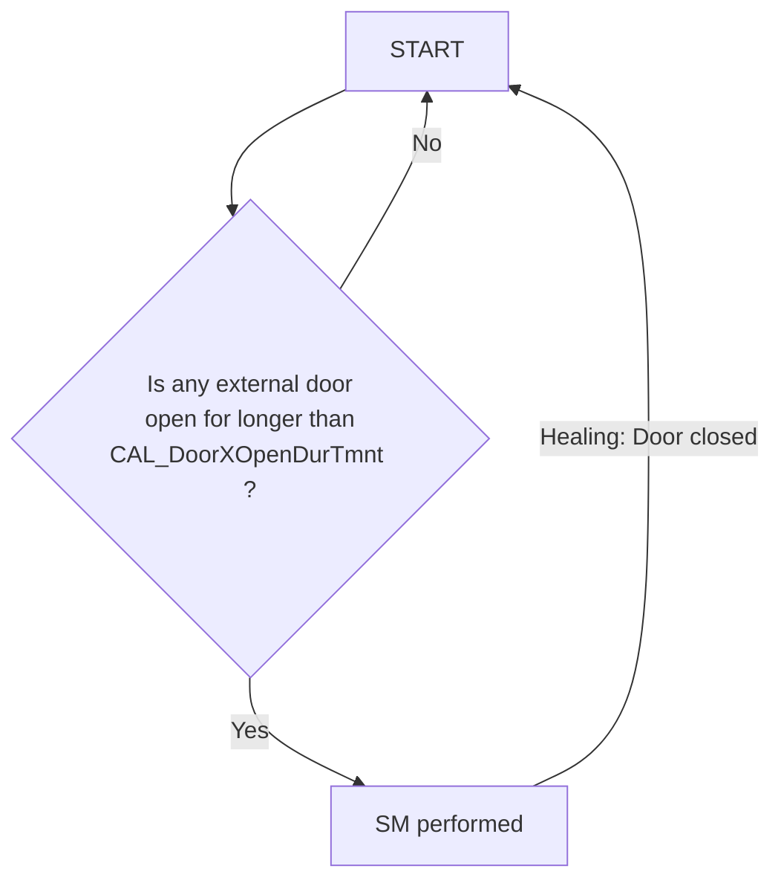
```mermaid
flowchart TD
    A[START] -->| | B{Is any external door\n open for longer than \nCAL_DoorXOpenDurTmnt ?}
    B -->|No| A
    B -->|Yes| C[SM performed]
    C -->|Healing: Door closed| A
```

    -SM shall be realized by sending a notification of level 2

##### SM_DMC_3 (Occupancy-based External Door Locking)

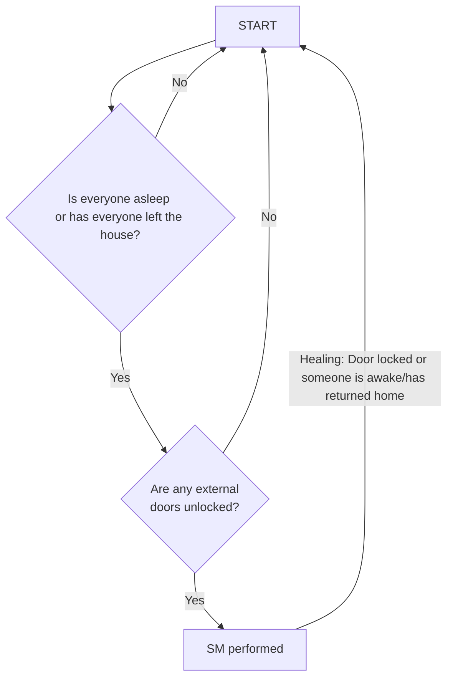
```mermaid
flowchart TD
    A[START] -->| | B{Is everyone asleep \nor has everyone left the house?}
    B -->|No| A
    B -->|Yes| C{Are any external \ndoors unlocked?}
    C -->|No| A
    C -->|Yes| D[SM performed]
    D -->|Healing: Door locked or \nsomeone is awake/has returned home| A
```

    - SM shall be realized by sending a notification of level 3 and scheduling a door lock action if feasible.

##### SM_DMC_4 (Maintenance of Door Sensors)

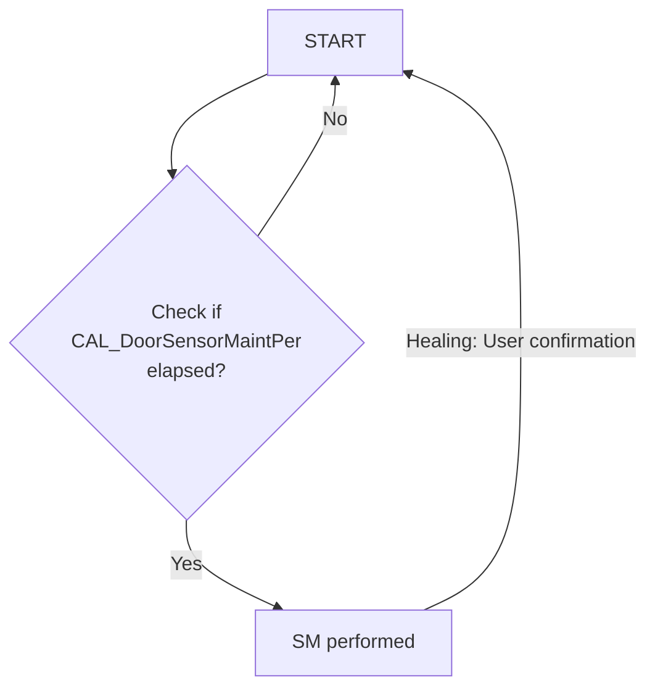
```mermaid
flowchart TD
    A[START] -->| | B{Check if \nCAL_DoorSensorMaintPer\n elapsed?}
    B -->|No| A
    B -->|Yes| C[SM performed]
    C -->|Healing: User confirmation| A
```

    -SM shall be realized by scheduling maintenance action for user

#### **System Monitoring Component:**

**Inputs:**

- Sensor and actuator status data
- System health data
- Power supply status
- System update information
- Ethernet port status
- Link status to router
- Link status to WAN
- System latency data
- Packet loss data

**Outputs:**

- Alerts to occupants
- System maintenance reminders/actions

**Safety Goals Addressed:**

- The system shall consistently monitor the activity of all sensors and actuators to detect timeouts and failures.
- The system shall remind the users about updates periodically.
- The system shall provide a backup power supply to ensure continuous operation in the event of a power outage.
- The system shall perform regular self-checks or diagnostics to identify and alert users to potential failures or malfunctions.
- The system shall monitor network connectivity and performance, including Ethernet port status, system latency, and packet loss.
- The system shall monitor the health of the Zigbee network.
- The system shall integrate with the existing Home Automation (HA) fault manager.

##### SM_SMC_1a (Output Sanity Monitoring)

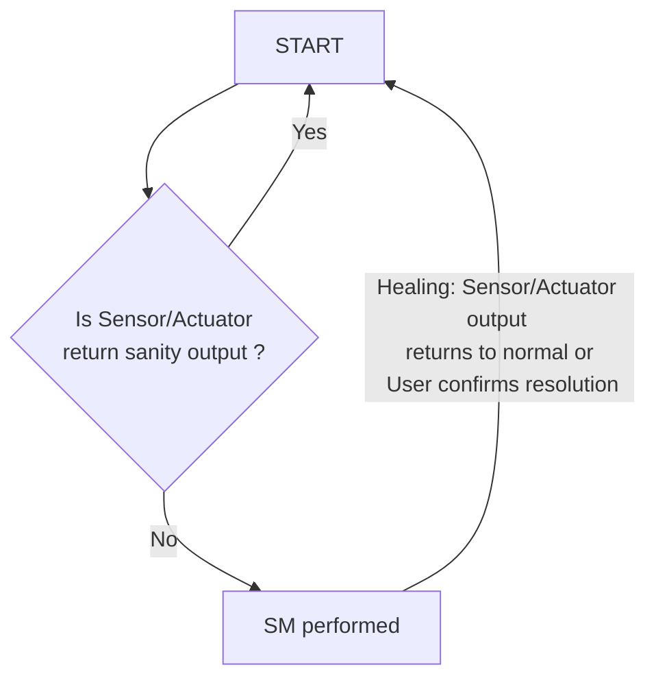
```mermaid
flowchart TD
    A[START] -->| | B{Is Sensor/Actuator \nreturn sanity output ?}
    B -->|Yes| A
    B -->|No| C[SM performed]
    C -->|Healing: Sensor/Actuator output \nreturns to normal or\n User confirms resolution| A
```

    - SM shall be realized by sending a notification based on sensor/actuator type.

##### SM_SMC_1b (Timeout Monitoring)

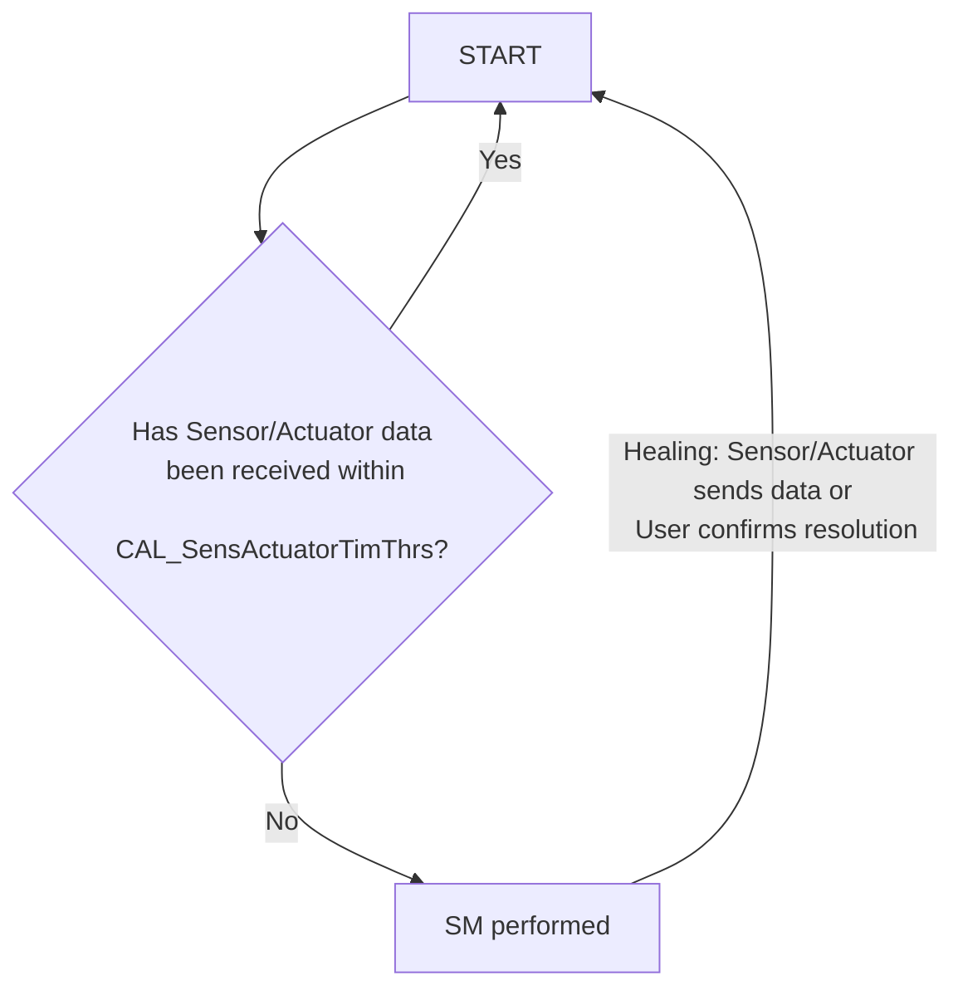
```mermaid
flowchart TD
    A[START] -->| | B{Has Sensor/Actuator data\n been received within\n CAL_SensActuatorTimThrs?}
    B -->|Yes| A
    B -->|No| C[SM performed]
    C -->|Healing: Sensor/Actuator sends data or\n User confirms resolution| A
```

    - SM shall be realized by sending a notification based on sensor/actuator type.

##### SM_SMC_1c (Battery Level Monitoring)

```mermaid
flowchart TD
    A[START] -->| | B{Is Sensor/Actuator \nbattery level within \nCAL_SensorActuatorBattLvlThrs?}
    B -->|Yes| A
    B -->|No| C[SM performed]
    C -->|Healing: Sensor/Actuator \nbattery replaced or \nrecharged or \nUser confirms resolution| A
```

    - SM shall be realized by sending a notification to replace or recharge the battery, and scheduling the next battery replacement or recharge as required.

##### SM_SMC_2 (System Update Reminder)

```mermaid
flowchart TD
    A[START] -->| | B{Is there \na System Update available?}
    B -->|No| A
    B -->|Yes| C[SM performed]
    C -->|Healing: System Update performed or\n User confirms delay| A
```

    - SM shall be realized by sending a notification of level 3

##### SM_SMC_3 (Power Failure Management)

```mermaid
flowchart TD
    A[START] -->| | B{Is there a power outage?}
    B -->|No| A
    B -->|Yes| C{Is a UPS installed and functioning?}
    C -->|No| A
    C -->|Yes| D[SM performed]
    D -->|Healing: Power restored or \nUser confirms resolution| A
```

    - SM shall be realized by sending a notification of level 3

##### SM_SMC_4a (CPU Usage Monitoring)

```mermaid
flowchart TD
    A[START] -->| | B{Is CPU usage within \nCAL_CPUUsageThreshold?}
    B -->|Yes| A
    B -->|No| C[SM performed]
    C -->|Healing: CPU usage returns to normal or \nUser confirms resolution| A
```

    - SM shall be realized by sending a notification of level 3

##### SM_SMC_4b (RAM Usage Monitoring)

```mermaid
flowchart TD
    A[START] -->| | B{Is RAM usage within \nCAL_RAMUsageThreshold?}
    B -->|Yes| A
    B -->|No| C[SM performed]
    C -->|Healing: RAM usage returns to normal or \nUser confirms resolution| A
```

    - SM shall be realized by sending a notification of level 3

##### SM_SMC_4c (Disk Space Monitoring)

```mermaid
flowchart TD
    A[START] -->| | B{Is Disk Space within \nCAL_DiskSpaceThreshold?}
    B -->|Yes| A
    B -->|No| C[SM performed]
    C -->|Healing: Disk Space freed up or\n User confirms resolution| A
```

    - SM shall be realized by sending a notification of level 3

##### SM_SMC_4d (Hardware Temperature Monitoring)

```mermaid
flowchart TD
    A[START] -->| | B{Is Hardware temperature within \nCAL_HardwareTemperatureThrsh?}
    B -->|Yes| A
    B -->|No| C[SM performed]
    C -->|Healing: Hardware temperature \nreturns to normal or \nUser confirms resolution| A
```

    - SM shall be realized by sending a notification of level 3

##### SM_SMC_4e (Ethernet Link Status)

```mermaid
flowchart TD
    A[START] -->| | B{Is Ethernet link active?}
    B -->|Yes| A
    B -->|No| C[SM performed]
    C -->|Healing: Ethernet link active| A
```

    - SM shall be realized by sending a notification of level 3

##### SM_SMC_4f(Local Network Connectivity)

```mermaid
flowchart TD
    A[START] -->| | B{Is router reachable?}
    B -->|Yes| A
    B -->|No| C[SM performed]
    C -->|Healing: Router reachable| A
```

    - SM shall be realized by sending a notification of level 3

##### SM_SMC_4g (Internet Access Management)

```mermaid
flowchart TD
    A[START] -->| | B{Is Internet reachable?}
    B -->|Yes| A
    B -->|No| C[SM performed]
    C -->|Healing: Internet reachable| A
```

    - SM shall be realized by sending a notification of level 3

##### SM_SMC_4h (Internet Latency Monitoring)

```mermaid
flowchart TD
    A[START] -->| | B{Is Internet latency \nbelow CAL_InternetLatencyThreshold?}
    B -->|Yes| A
    B -->|No| C[SM performed]
    C -->|Healing: Internet latency \nabove threshold| A

```

    - SM shall be realized by sending a notification of level 3

##### SM_SMC_4i (Packet Loss Monitoring)

```mermaid
flowchart TD
    A[START] -->| | B{Is packet loss below\n CAL_PacketLossThreshold?}
    B -->|Yes| A
    B -->|No| C[SM performed]
    C -->|Healing: Packet loss \nabove threshold| A
```

    - SM shall be realized by sending a notification of level 3

#### **HVAC Monitoring Component:**

**Inputs:**

- Current flow temperature
- Heater/cooler status

**Outputs:**

- Alert to occupants
- HVAC maintenance reminders/actions

**Outputs:**

- The system shall continuously monitor the current flow temperature and compare it against the expected temperature range to detect any potential heater errors or anomalies.

**SM_HMC_1 (Heating/Cooling Flow Monitoring)**

```mermaid
flowchart TD
    A[START] -->| | B{Is the current \nflow temperature within\n CAL_THRFlowTemperature?}
    B -->|Yes| A
    B -->|No| C[SM performed]
    C -->|Healing: Flow temperature returns to normal| A
```

    - SM shall be realized by sending a notification of level 2

---

**SM_HMC_2 (Temperature Rate of Change Monitoring)**

```mermaid
flowchart TD
    A[START] -->| | B{Is the current flow\n temperature within \nCAL_THRFlowTemperature?}
    B -->|Yes| A
    B -->|No| C[SM performed]
    C -->|Healing: Flow temperature returns to normal| A
```
    - SM shall be realized by sending a notification of level 2

---