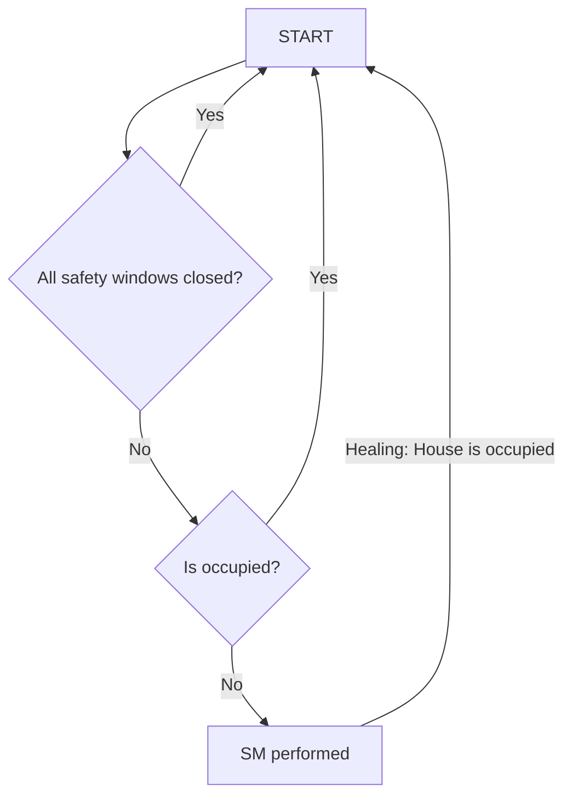
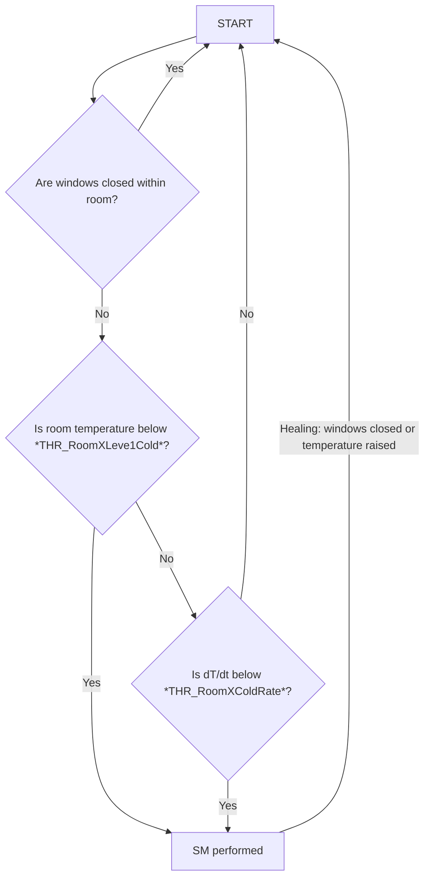
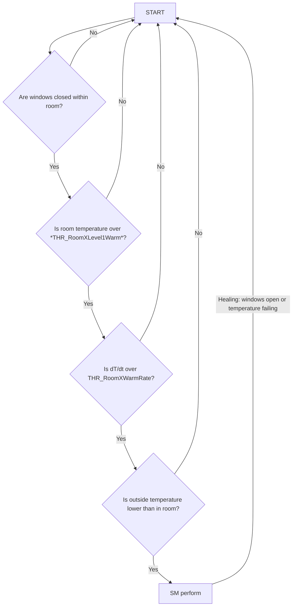
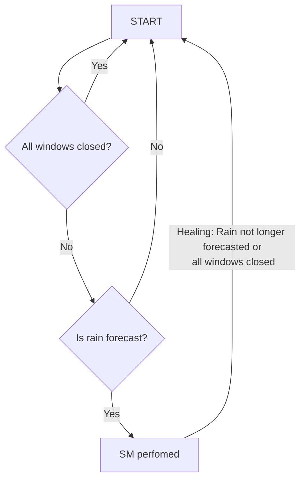
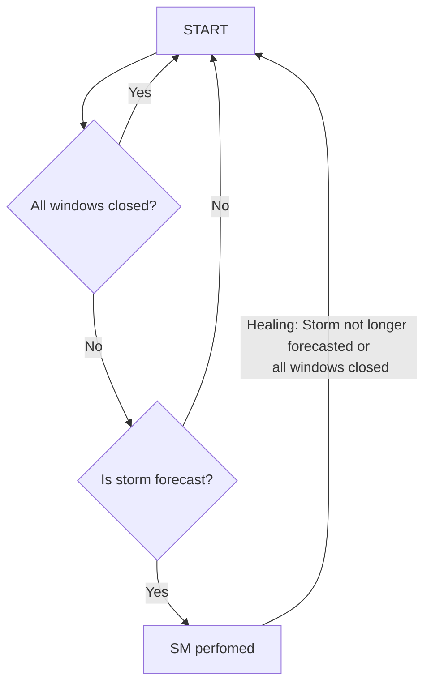
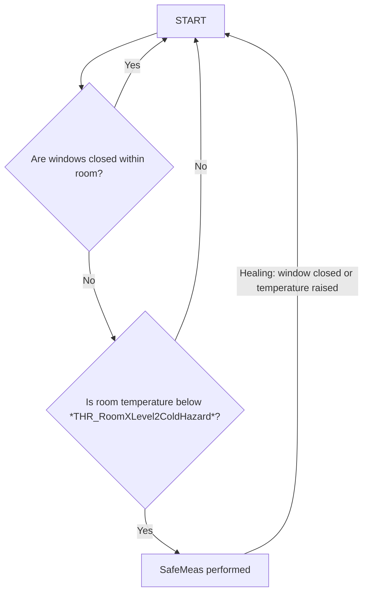

# Home Automation - Safety, security and recovery strategy

---
---
## 2. System requirements 
---
---
### 2.1 System boundaries  
---
#### 2.1.1 Inside the System Boundary:
---
Hardware sensors - Input interface:  
- windows contact sensor
- door contact sensor
- smoke detector
- gas detector
- carbon monooxide detector
- climate sensor for each room (temperature and humidity)  
- inside air pollution
- boiler process values

Cloud sensors - Input interface:  
- Weather sensor
    - Current temperature, pressure, wind speed, clouds
    - Forecast for temperature, pressure, wind speed, clouds
    - Hazardous fenoma:
        - Storm alert
        - Blizzard alert
        - Wind alert
        - Rain alert
        - Heatwave alert
        - Tornado alert
- Occupancy sensor
- Outside air pollution

HW Actuators - Output interface: 
- Smart locks
- Siren
- Information light
- Alert light

Cloud Actuators:
- Phone application popup
- Main card in Lovelance
- User action scheduler

Processing:
- Home assistant instance

---
#### 2.1.2 Outside the System Boundary:
---
- The physical environment where the home is located and which the sensors are monitoring
- Users who interact with the system, either physically or through an interface/app
- Internet services providing data such as weather forecasts

---
#### 2.1.3 System modes:
---
**Armed Mode:** 
- The system is actively monitoring for hazards and is ready to react.   

**Disarmed Mode:** 
- The system is not actively monitoring for hazards.   

**Maintenance Mode:** 
- The system checks the status of its sensors and actuators, updates its software, and performs other maintenance tasks.

TODO - Add state machine
---
#### 2.1.4 Interfaces requirements:
---
#### Smoke/Gas/CO sensor
    - TODO

#### Smoke/Gas/CO sensor
    - TODO

#### Window/Door contact
    - Shall support contact notification
    - Shall support remained batery value
#### House occupy
    - Sleep time - Event that notify that everyone goes to sleep
    - Leave - Home is empty less than 1 day
    - Vacation - Home is empty more than 1 day
    - Home Alone: Only one person is at home. This could adjust safety and security measures, and change other settings like temperature or lighting.
    - Guests: You have guests over. This may require different settings for privacy, security, or comfort.
    - Kids: Only not adult residents are in house.

#### Weather sensor
    - TODO

#### Weather environmental hazards:
    - Freezing - Temperature below 4 C
    - Storm - Incoming storm
    - Rain
    - Air pollution - Air pollution 2.5pmm above 20
    - Heatwave: High temperatures might require specific responses such as closing blinds, turning on air conditioning, etc.
    - High Wind: Could lead to similar responses as a storm.
    - Snow: Cold temperatures combined with snowfall might affect heating systems and require specific actions.
    - High Humidity: This might trigger dehumidifiers or other responses to control internal humidity.

#### Outside air pollution sensor
    - TODO

#### Heating output values
    - TODO

#### Heating input values
    - TODO

#### Smart lock actuator
    - TODO

#### Alarm siren
    - TODO

#### Informational light
    - TODO

#### Smart lock actuator
    - TODO

#### Alert light
    - TODO

#### Phone application popup
    - TODO

#### Lovelance card
    - TODO

#### User action scheduler
    - TODO

---
#### 2.1.6 Common definitions:
---
- Safety windows/door are elements that should be closed if nobody are in house, like front windows.
---
#### 2.1.5 System components:
---

**Window Monitoring Component:**  

**Inputs:**  
- Window contact sensor data
- Occupancy sensor data
- Room temperature sensor data
- Outside temperature data (from weather forecast)
- Rain forecast data (from weather forecast)
- Storm forecast data (from weather forecast)

**Outputs:**   

- Alerts to occupants (via various channels)
- Heating system actactors

**Safety Goals Addressed:**

    - Front windows shall be closed if nobody/kids are in the house
    - The system shall notify occupants if the temperature is falling and windows are open
    - The system shall notify occupants if temperature is increasing, windows are closed if outside temperature is lower than in room.
    - The system shall notify occupants of incoming rain if one of the doors or windows is open
    - The system shall notify occupants if a storm is coming and windows are open
    - The system shall increase heating if temperature is falling and windows are open

**States and Transitions:**
#### SM_WMC_1

    - SM shall be realized by notification of level 2
#### SM_WMC_2

    - SM shall be realized by notification of level 2

#### SM_WMC_3

    - SM shall be realized by notification of level 2
#### SM_WMC_4

    - SM shall be realized by notification of level 2
#### SM_WMC_5

    - SM shall be realized by notification of level 1

#### SM_WMC_6

    - SM shall be realized increasing setpoint value for specif room by THR_HeatingIncrease

    **Hazardous Atmosphere Detection Component:**

    **Inputs:**
    - Smoke detector sensor data
    - Gas detector sensor data
    - Carbon monoxide detector sensor data

    **Outputs:**

    - Alerts to occupants
    - External doors unlocked for evacuation
    - Gas supply shut off command in case of gas detection

    **Safety Goals Addressed:**
    - Fire detection and alert
    - Gas leak detection and alert
    - Carbon Monoxide Poisoning detection and alert
    - Maintenance notification for smoke, gas, and carbon monoxide sensors

--- 

---
#### 2.1.6 System Calibration values:
---

## 4. System components requirements:
### 3.1 Windows and doors close status
    - Each doors and windows shall have defined safety status for scenarios:
        - Sleep time
        - Vacation (more than 1 day)
        - Out (less than 1 day)
    - External doors shall have defined timeout
    - System shall monitor outside temperature, corresponding room temperature and window status
    - System shall monitor external air pollution and windows status

    - Possible safestates:
        - OPEN - Shall be open
        - CLOSED - Shall be closed
        - NOTIFICATION - Notify current status

    | | Sleep time | Leaving | Vacation |
    | -------- | -------- | -------- | -------- |
    | Bedroom door | CLOSED | CLOSED | CLOSED |
    | Upper bathroom door | CLOSED | CLOSED | CLOSED |
    | Office door | CLOSED | CLOSED | CLOSED |
    | Wardrobe door | CLOSED | CLOSED | CLOSED |
    | Kids Room door | CLOSED | CLOSED | CLOSED |
    | Bathroom door | CLOSED | CLOSED | CLOSED |
    | Garage door | CLOSED | CLOSED | OPEN |
    | Upper bathroom window | NOTIFICATION | NOTIFICATION | CLOSED |
    | Bedroom window | NOTIFICATION | CLOSED | CLOSED |
    | Kids Room window | NOTIFICATION | NOTIFICATION | CLOSED |
    | Office window | NOTIFICATION | NOTIFICATION | CLOSED |
    | Bathroom window | CLOSED | CLOSED | CLOSED |
    | Kitchen window | CLOSED | CLOSED | CLOSED |
    | Living room window | CLOSED | CLOSED | CLOSED |
    | Garage gate | CLOSED | CLOSED | CLOSED |
    | Entrance door | CLOSED | CLOSED | CLOSED |
    | Living Room door | CLOSED | CLOSED | CLOSED |

    #### Priorities
    - External doors dangers are always priority 1
    - All daggers during leaving and vacation conditions are priority 1 except notification cases.
    - Dangers with notification RA are always priority 2
    - Sleep time daggers for windows and door are priority 1 except notification

    ### 3.2 External doors timeouts
    - Dangers shall be active if external doors are open longer than specified in the table.
        - Garage gate: 120s
        - Entrance door: 60s
        - Living Room door: 3h
    #### Priorites
    - External doors dangers are always priority 1

