# Home Automation - Safety, security and recovery strategy

---
---
## 2. System requirements 
---
---
### 2.1 System boundaries  
---
#### 2.1.1 Inside the System Boundary:
---
Hardware sensors - Input interface:  
- windows contact sensor
- door contact sensor
- smoke detector
- gas detector
- carbon monooxide detector
- climate sensor for each room (temperature and humidity)  
- inside air pollution
- boiler process values

Cloud sensors - Input interface:  
- Weather sensor
    - Current temperature, pressure, wind speed, clouds
    - Forecast for temperature, pressure, wind speed, clouds
    - Hazardous fenoma:
        - Storm alert
        - Blizzard alert
        - Wind alert
        - Rain alert
        - Heatwave alert
        - Tornado alert
- Occupancy sensor
- Outside air pollution
- System health data and system update information
- Ethernet port status
- Link status to router
- Link status to WAN
- System latency data
- Packet loss data

HW Actuators - Output interface: 
- Smart locks
- Siren
- Information light
- Alert light

Cloud Actuators:
- Phone application popup
- Main card in Lovelance
- User action scheduler

Processing:
- Home assistant instance

---
#### 2.1.2 Outside the System Boundary:
---
- The physical environment where the home is located and which the sensors are monitoring
- Users who interact with the system, either physically or through an interface/app
- Internet services providing data such as weather forecasts

---
#### 2.1.3 System modes:
---
**Armed Mode:** 
- The system is actively monitoring for hazards and is ready to react.   

**Disarmed Mode:** 
- The system is not actively monitoring for hazards.   

**Maintenance Mode:** 
- The system checks the status of its sensors and actuators, updates its software, and performs other maintenance tasks.

TODO - Add state machine
---
#### 2.1.4 Interfaces requirements:
---
#### Smoke/Gas/CO sensor
    - TODO

#### Smoke/Gas/CO sensor
    - TODO

#### Window/Door contact
    - Shall support contact notification
    - Shall support remained batery value
#### House occupy
    - Sleep time - Event that notify that everyone goes to sleep
    - Leave - Home is empty less than 1 day
    - Vacation - Home is empty more than 1 day
    - Home Alone: Only one person is at home. This could adjust safety and security measures, and change other settings like temperature or lighting.
    - Guests: You have guests over. This may require different settings for privacy, security, or comfort.
    - Kids: Only not adult residents are in house.
    - Occupied: Adult residents are in house

#### Weather sensor
    - TODO

#### Weather environmental hazards:
    - Freezing - Temperature below 4 C
    - Storm - Incoming storm
    - Rain
    - Air pollution - Air pollution 2.5pmm above 20
    - Heatwave: High temperatures might require specific responses such as closing blinds, turning on air conditioning, etc.
    - High Wind: Could lead to similar responses as a storm.
    - Snow: Cold temperatures combined with snowfall might affect heating systems and require specific actions.
    - High Humidity: This might trigger dehumidifiers or other responses to control internal humidity.

#### Outside air pollution sensor
    - TODO

#### System health data and system update information
    - TODO

#### Ethernet network health:
TODO
- Ethernet port status
- Link status to router
- Link status to WAN
- System latency data
- Packet loss data

#### Heating output values
    - TODO

#### Heating input values
    - TODO

#### Smart lock actuator
    - TODO

#### Alarm siren
    - TODO

#### Informational light
    - TODO

#### Smart lock actuator
    - TODO

#### Alert light
    - TODO

#### Phone application popup
    - TODO

#### Lovelance card
    - TODO

#### User action scheduler
    - TODO

---
#### 2.1.6 Common definitions:
---
- Safety windows/door are elements that should be closed if nobody are in house, like front windows.
- Notifiaction levels:  

|  | Description Notification |
| -------- | -------- |
| Level 1 | Home assistant notification on phone with higher priority, sound alarm, light notification as yellow, and dashboard information as hazard |
| Level 2 | Home assistant notification on phone with higher priority, light notification as yellow, and dashboard information as hazard |
| Level 3 | Home assistant notification on phone and dashboard information as warning |
| Level 4 | Dashboard information |

---
#### 2.1.5 System components:
---

#### **Window Monitoring Component:**  

**Inputs:**  
- Window contact sensor data
- Occupancy sensor data
- Room temperature sensor data
- Outside temperature data (from weather forecast)
- Rain forecast data (from weather forecast)
- Storm forecast data (from weather forecast)

**Outputs:**   

- Alerts to occupants (via various channels)
- Heating system actactors

**Safety Goals Addressed:**

    - Front windows shall be closed if nobody/kids are in the house
    - The system shall notify occupants if the temperature is falling and windows are open
    - The system shall notify occupants if temperature is increasing, windows are closed if outside temperature is lower than in room.
    - The system shall notify occupants of incoming rain if one of the doors or windows is open
    - The system shall notify occupants if a storm is coming and windows are open
    - The system shall increase heating if temperature is falling and windows are open
    - The system should alert occupants if air quality falls below a certain standard and any window is open. 

**States and Transitions:**
##### SM_WMC_1
```mermaid
flowchart TD
    A[START] -->| | B{Are all safety windows closed?}
    B -->|Yes| A
    B -->|No| C{Is the house in "occupied" occupancy status?}
    C -->|Yes| A
    C -->|No| E[SM performed]
    E -->|Healing: House is occupied| A
```
    - SM shall be realized by notification of level 2
##### SM_WMC_2
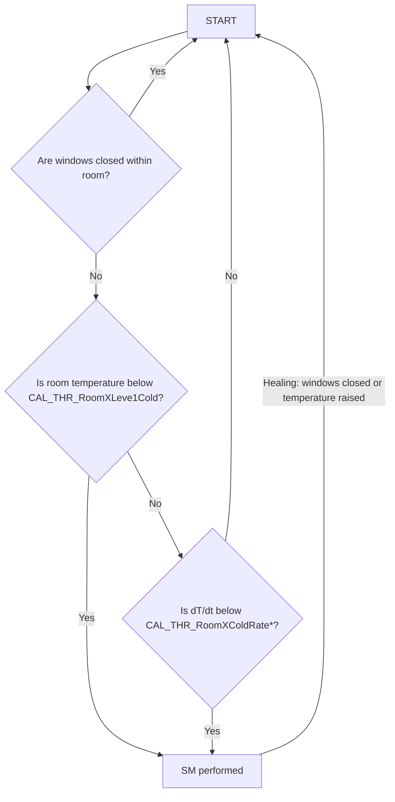
```mermaid
flowchart TD
    A[START] -->| | B{Are windows closed within room?}
    B -->|Yes| A
    B -->|No| C{Is room temperature below CAL_THR_RoomXLeve1Cold?}
    C -->|No| D{Is dT/dt below CAL_THR_RoomXColdRate*?}
    C -->|Yes| E[Notification on level B?]
    D -->|No| A
    D-->|Yes| E[SM performed]
    E -->|Healing: windows closed or temperature raised| A
```
    - SM shall be realized by notification of level 2

##### SM_WMC_3
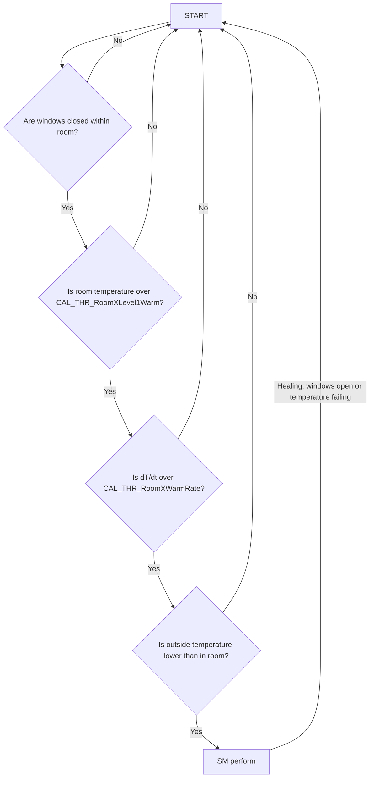
```mermaid
flowchart TD
    A[START] -->| | B{Are windows closed within room?}
    B -->|No| A
    B -->|Yes| C{Is room temperature over CAL_THR_RoomXLevel1Warm?}
    C -->|No| A
    C -->|Yes| D{Is dT/dt over CAL_THR_RoomXWarmRate?}
    D -->|Yes| E{Is outside temperature lower than in room?}
    D  -->|No| A
    E -->|No| A
    E -->|Yes| F[SM perform ]
    F -->|Healing: windows open or temperature failing| A
```
    - SM shall be realized by notification of level 3
##### SM_WMC_4

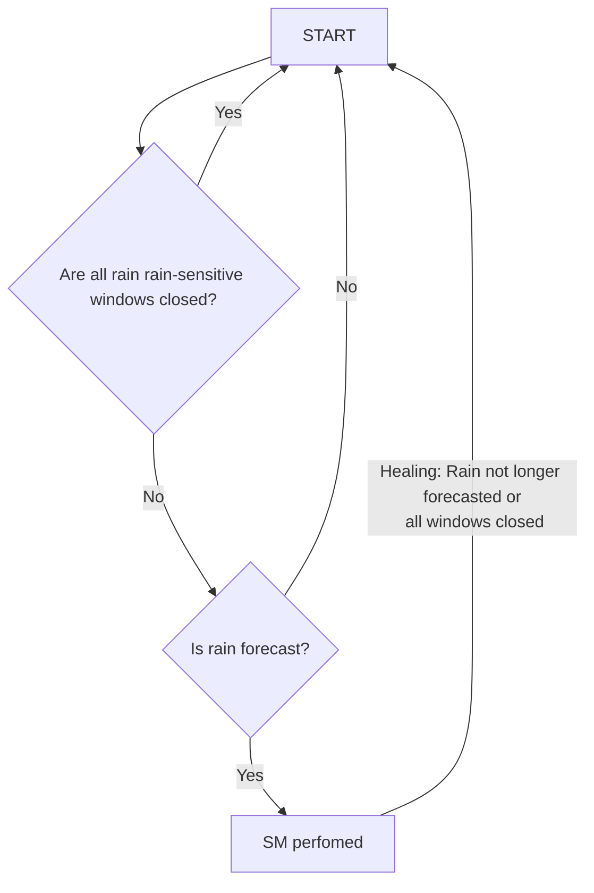
```mermaid
flowchart TD
    A[START] -->| | B{Are all rain rain-sensitive windows closed?}
    B -->|Yes| A
    B -->|No| C{Is rain forecast?}
    C -->|No| A
    C -->|Yes| E[SM perfomed]
    E -->|Healing: Rain not longer forecasted or\n all windows closed| A
```
    - SM shall be realized by notification of level 2
##### SM_WMC_5
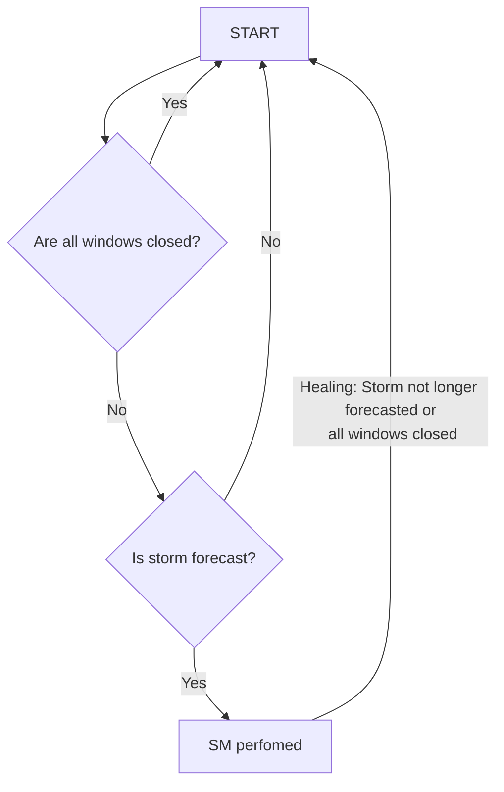
```mermaid
flowchart TD
    A[START] -->| | B{Are all windows closed?}
    B -->|Yes| A
    B -->|No| C{Is storm forecast?}
    C -->|No| A
    C -->|Yes| E[SM perfomed]
    E -->|Healing: Storm not longer forecasted or\n all windows closed| A
```
    - SM shall be realized by notification of level 2

##### SM_WMC_6
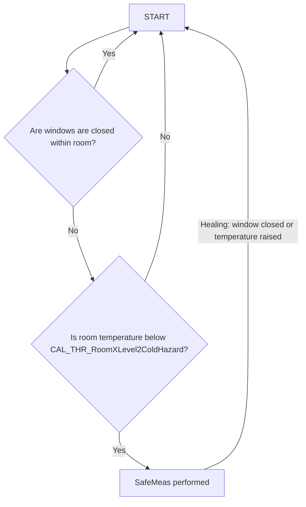
```mermaid
flowchart TD
    A[START] -->| | B{Are windows are closed within room?}
    B -->|Yes| A
    B -->|No| C{Is room temperature below CAL_THR_RoomXLevel2ColdHazard?}
    C -->|No| A
    C-->|Yes| E[SafeMeas performed]
    E -->|Healing: window closed or temperature raised| A
```
    - SM shall be realized increasing setpoint value for specif room by CAL_THR_HeatingIncrease

##### SM_WMC_7
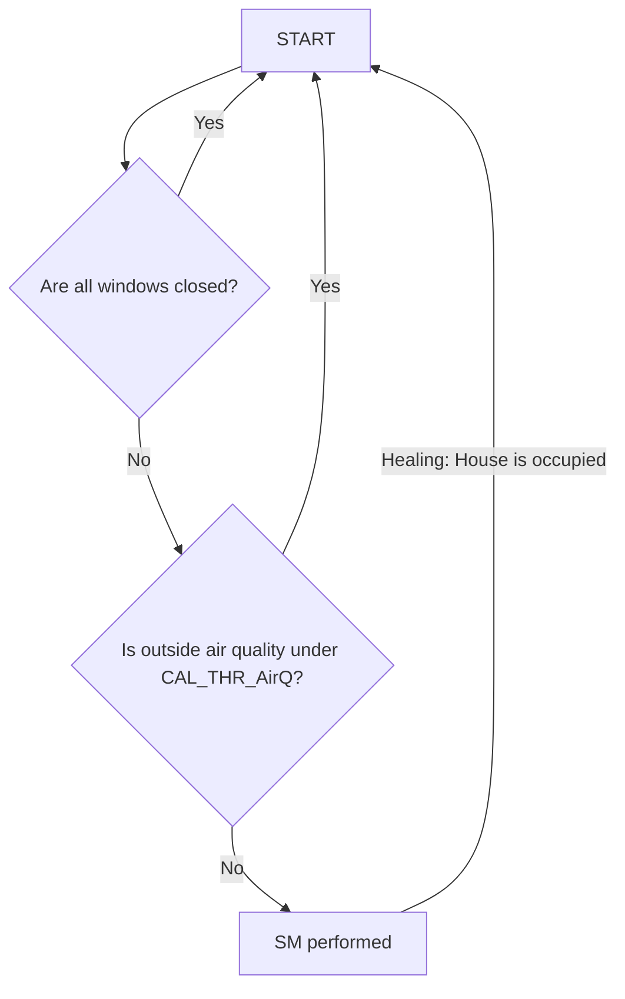
```mermaid
flowchart TD
    A[START] -->| | B{Are all windows closed?}
    B -->|Yes| A
    B -->|No| C{Is outside air quality under CAL_THR_AirQ?}
    C -->|Yes| A
    C -->|No| E[SM performed]
    E -->|Healing: House is occupied| A
```
    - SM shall be realized by notification of level 2

##### SM_WMC_8
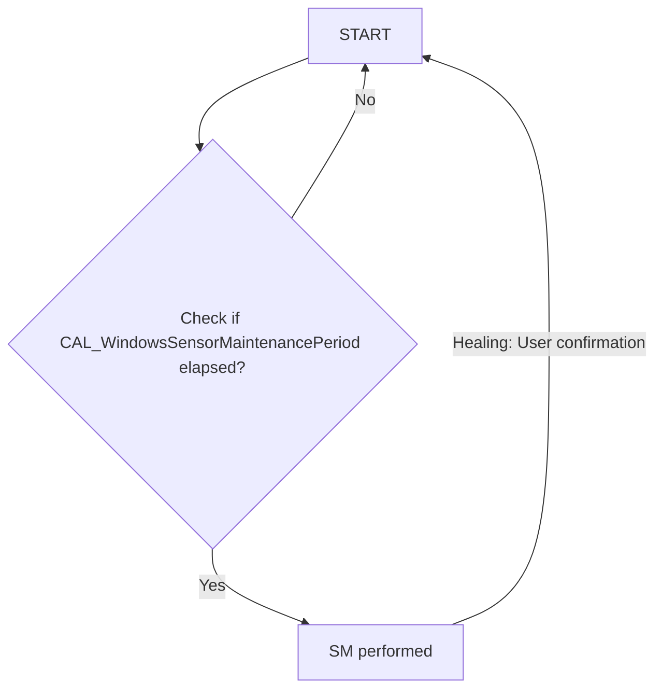
```mermaid
flowchart TD
    A[START] -->| | B{Check if CAL_WindowsSensorMaintenancePeriod elapsed?}
    B -->|No| A
    B -->|Yes| C[SM performed]
    C -->|Healing: User confirmation| A
```
    -SM shall be realized by scheduling maintenance action for user
--- 
#### **Hazardous Atmosphere Detection Component:**  

**Inputs:**:
- Smoke detector sensor data
- Gas detector sensor data
- Carbon monoxide detector sensor data

**Outputs:**

- Alerts to occupants
- External doors unlocked for evacuation
- Scheduler

**Safety Goals Addressed:**
- Fire detection and alert
- Gas leak detection and alert
- Carbon Monoxide Poisoning detection and alert
- Maintenance notification for smoke, gas, and carbon monoxide sensors

##### SM_HADC_1
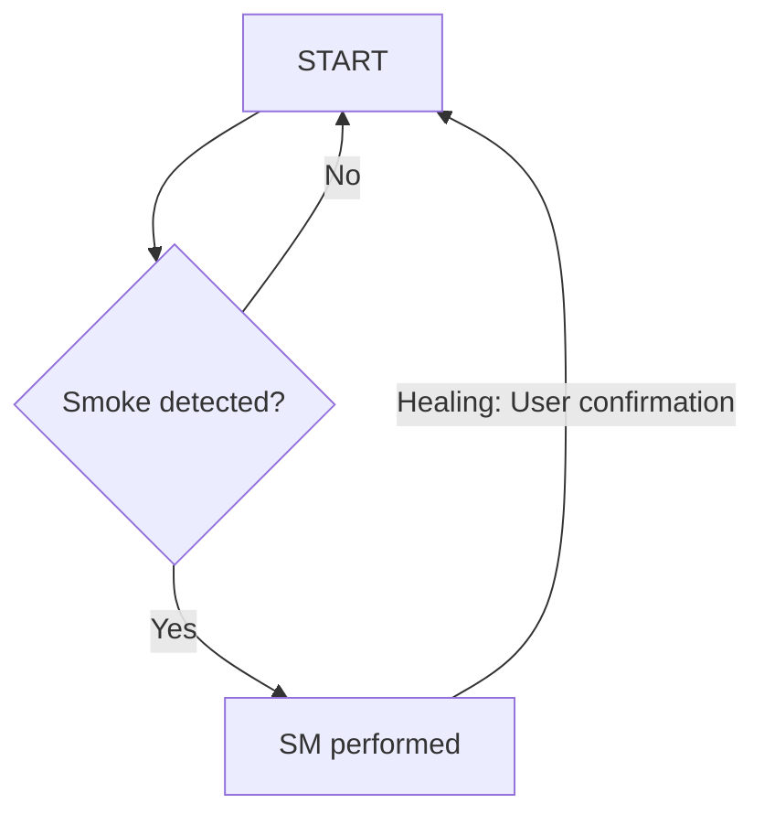
```mermaid
flowchart TD
    A[START] -->| | B{Smoke detected?}
    B -->|No| A
    B -->|Yes| C[SM performed]
    C -->|Healing: User confirmation| A
```
    -SM shall be realized by notification of level 1 and evacuation process

##### SM_HADC_2
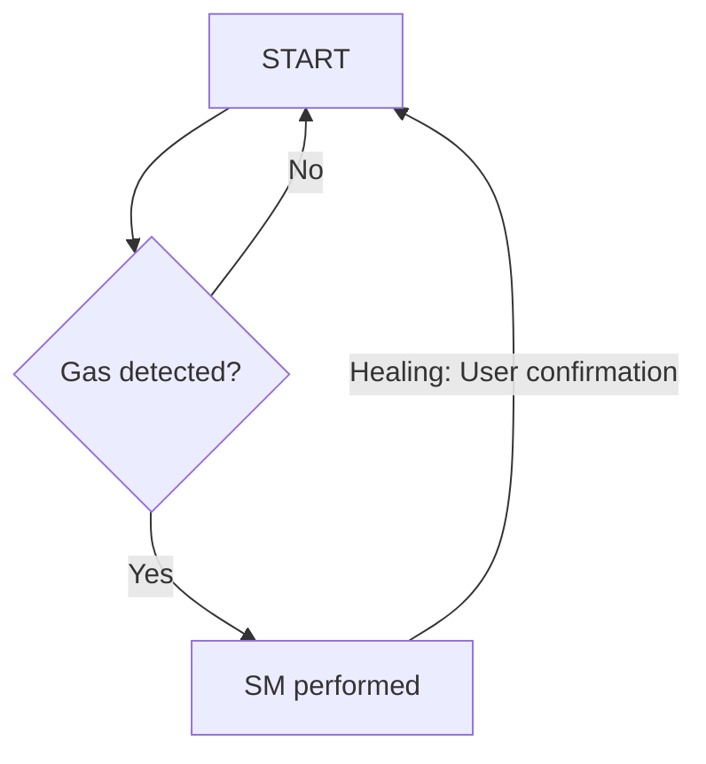
```mermaid
flowchart TD
    A[START] -->| | B{Gas detected?}
    B -->|No| A
    B -->|Yes| C[SM performed]
    C -->|Healing: User confirmation| A
```
    -SM shall be realized by notification of level 1 and evacuation process

##### SM_HADC_3
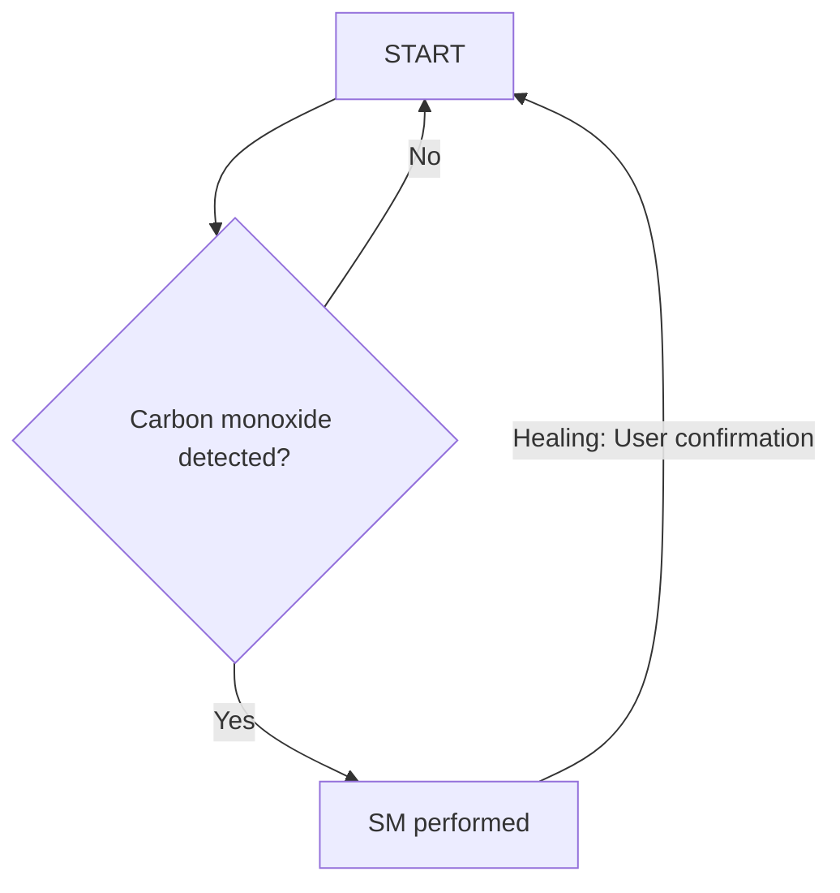
```mermaid
flowchart TD
    A[START] -->| | B{Carbon monoxide detected?}
    B -->|No| A
    B -->|Yes| C[SM performed]
    C -->|Healing: User confirmation| A
```
    -SM shall be realized by notification of level 1 and evacuation process

##### SM_HADC_4

```mermaid
flowchart TD
    A[START] -->| | B{Check if CAL_GasLeakSensorMaintenancePeriod elapsed?}
    B -->|No| A
    B -->|Yes| C[SM performed]
    C -->|Healing: User confirmation| A
```
    -SM shall be realized by schedule maintenance action for user

##### SM_HADC_5 (Smoke Sensor Maintenance)
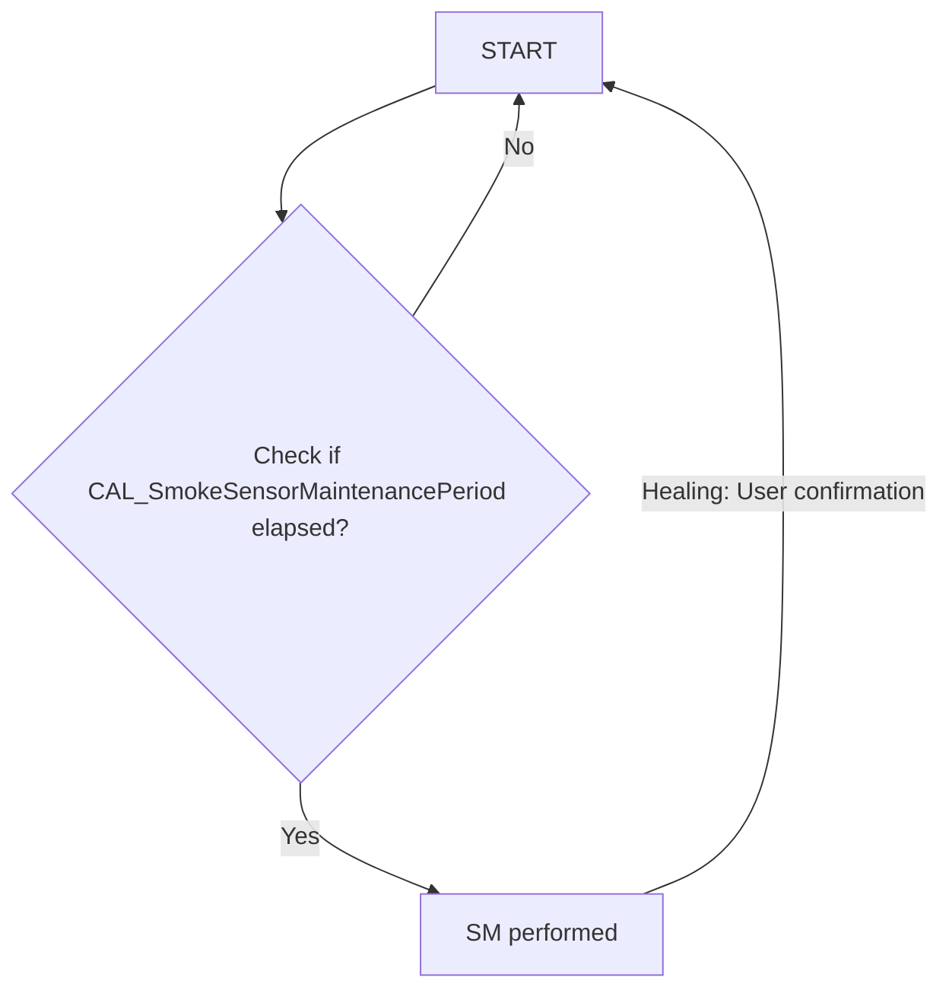
```mermaid
flowchart TD
    A[START] -->| | B{Check if CAL_SmokeSensorMaintenancePeriod elapsed?}
    B -->|No| A
    B -->|Yes| C[SM performed]
    C -->|Healing: User confirmation| A
```
    -SM shall be realized by schedule maintenance action for user
##### SM_HADC_6 (CO Sensor Maintenance)
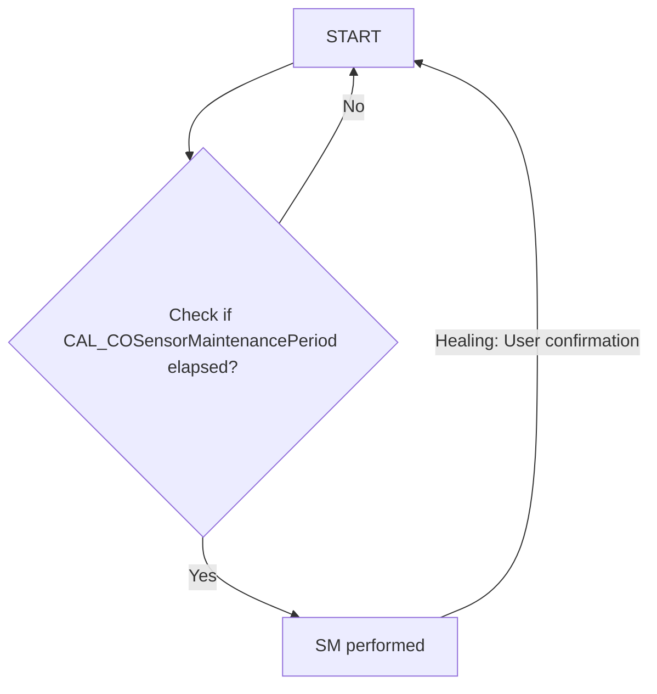
```mermaid
flowchart TD
    A[START] -->| | B{Check if CAL_COSensorMaintenancePeriod elapsed?}
    B -->|No| A
    B -->|Yes| C[SM performed]
    C -->|Healing: User confirmation| A
```
    -SM shall be realized by schedule maintenance action for user

#### **Door Monitoring Component:**
**Inputs:**
- Door contact sensor data
- Occupancy sensor data

**Outputs:**
-Alerts to occupants
-SmartLocks

**Safety Goals Addressed:**
- Detect if external doors are opened when no one is at home and alert
- Detect if external doors are left open for an extended period of time and alert
- Detect if external doors are not locked when everyone goes to sleep or leaves the house
- Maintenance notification for door contact sensors

##### SM_DMC_1 
```mermaid
flowchart TD
    A[START] -->| | B{Is the house in "leave"/"vacations"/"sleep"/"home alone" occupancy status?}
    B -->|No| A
    B -->|Yes| C{Are any external doors open?}
    C -->|No| A
    C -->|Yes| D[SM performed]
    D -->|Healing: Door closed or house is occupied| A
```
    -SM shall be realized by sending a notification of level 2

##### SM_DMC_2
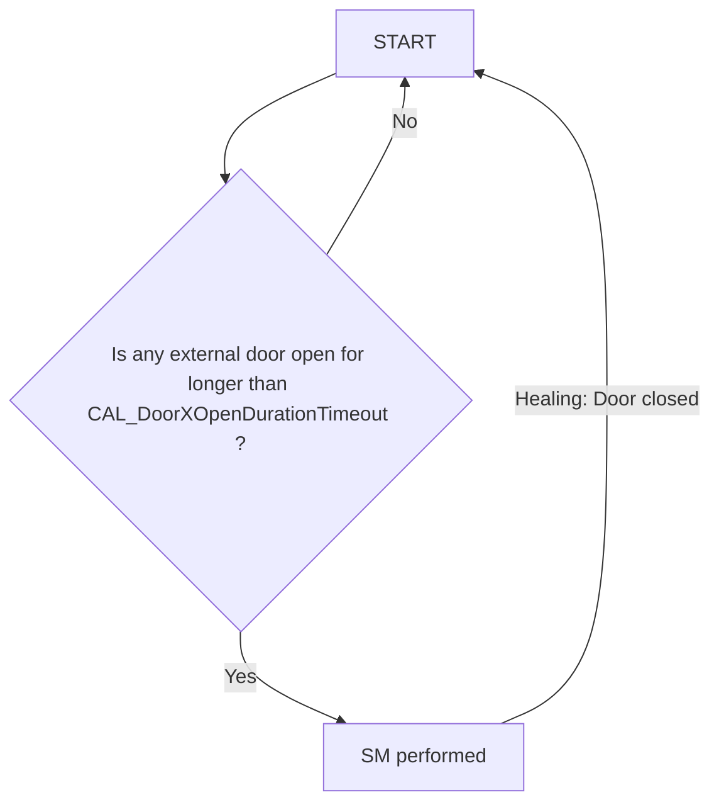
```mermaid
flowchart TD
    A[START] -->| | B{Is any external door open for longer than CAL_DoorXOpenDurationTimeout ?}
    B -->|No| A
    B -->|Yes| C[SM performed]
    C -->|Healing: Door closed| A
```
    -SM shall be realized by sending a notification of level 2

##### SM_DMC_3
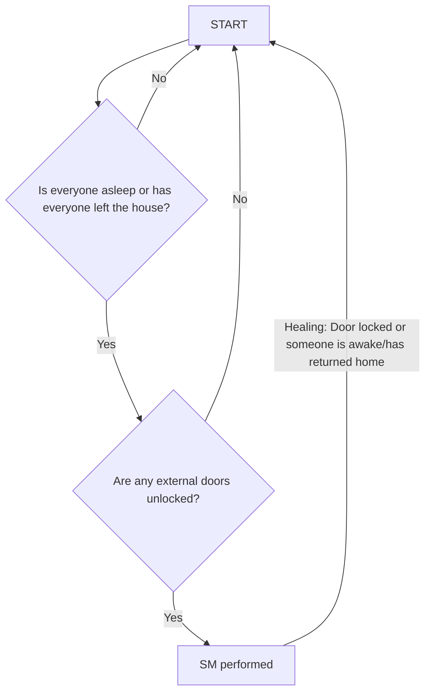
```mermaid
flowchart TD
    A[START] -->| | B{Is everyone asleep or has everyone left the house?}
    B -->|No| A
    B -->|Yes| C{Are any external doors unlocked?}
    C -->|No| A
    C -->|Yes| D[SM performed]
    D -->|Healing: Door locked or someone is awake/has returned home| A
```
    - SM shall be realized by sending a notification of level 3 and scheduling a door lock action if feasible.

##### SM_DMC_4
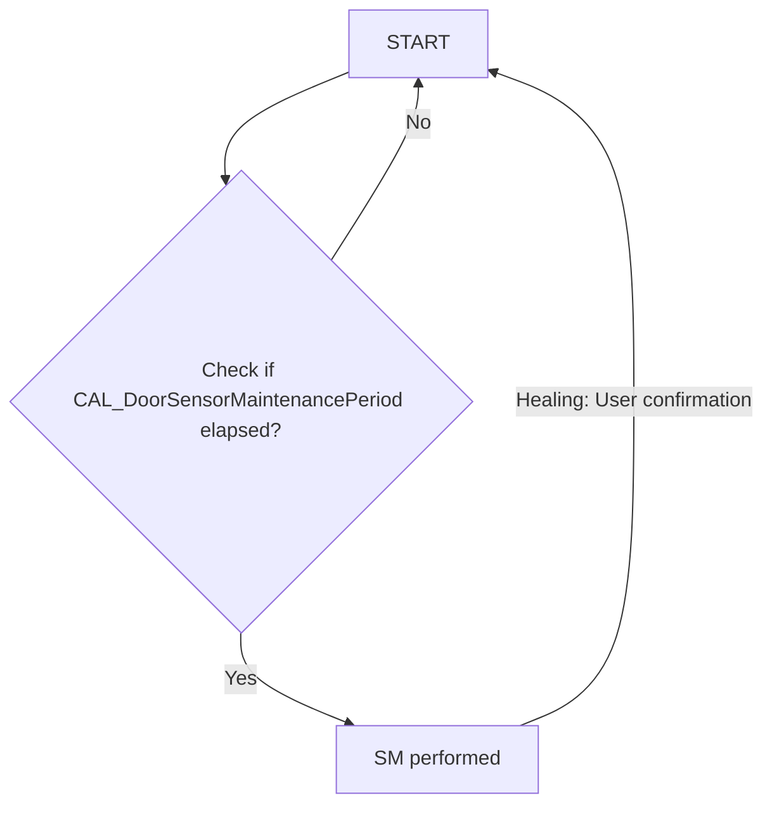
```mermaid
flowchart TD
    A[START] -->| | B{Check if CAL_DoorSensorMaintenancePeriod elapsed?}
    B -->|No| A
    B -->|Yes| C[SM performed]
    C -->|Healing: User confirmation| A
```
    -SM shall be realized by scheduling maintenance action for user

#### **System Monitoring Component:**

**Inputs:**
- Sensor and actuator status data
- System health data
- Power supply status
- System update information
- Ethernet port status
- Link status to router
- Link status to WAN
- System latency data
- Packet loss data

**Outputs:**

- Alerts to occupants
- System maintenance reminders/actions

**Safety Goals Addressed:**

- The system shall monitor all sensor and actuator activity to detect timeouts and failures.
- The system shall remind about updates
- The system should have a backup power supply to ensure continuous operation in the event of a power outage. This should include provisions to ensure safe operation or shutdown in case of power failure.
- The system should regularly perform self-checks or diagnostics to identify and alert users to potential failures or malfunctions. These checks should include things like checking for system updates, monitoring system health, and checking the status of safety devices.
- The system should monitor network connectivity and performance, including Ethernet port status, system latency, and packet loss.
- TODO:The system shall monitor zigbee network heatlh
- TODO:The system shall integrate with existed HA fault manager

##### SM_SMC_1a (Output Sanity Monitoring)
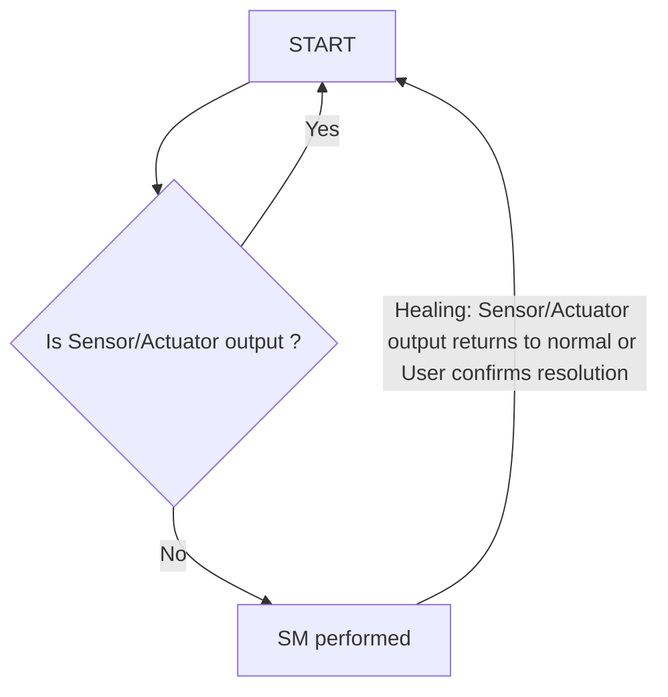
```mermaid
flowchart TD
    A[START] -->| | B{Is Sensor/Actuator output ?}
    B -->|Yes| A
    B -->|No| C[SM performed]
    C -->|Healing: Sensor/Actuator output returns to normal or User confirms resolution| A
```
    - SM shall be realized by sending a notification based on sensor/actuator type.

##### SM_SMC_1b (Timeout Monitoring)
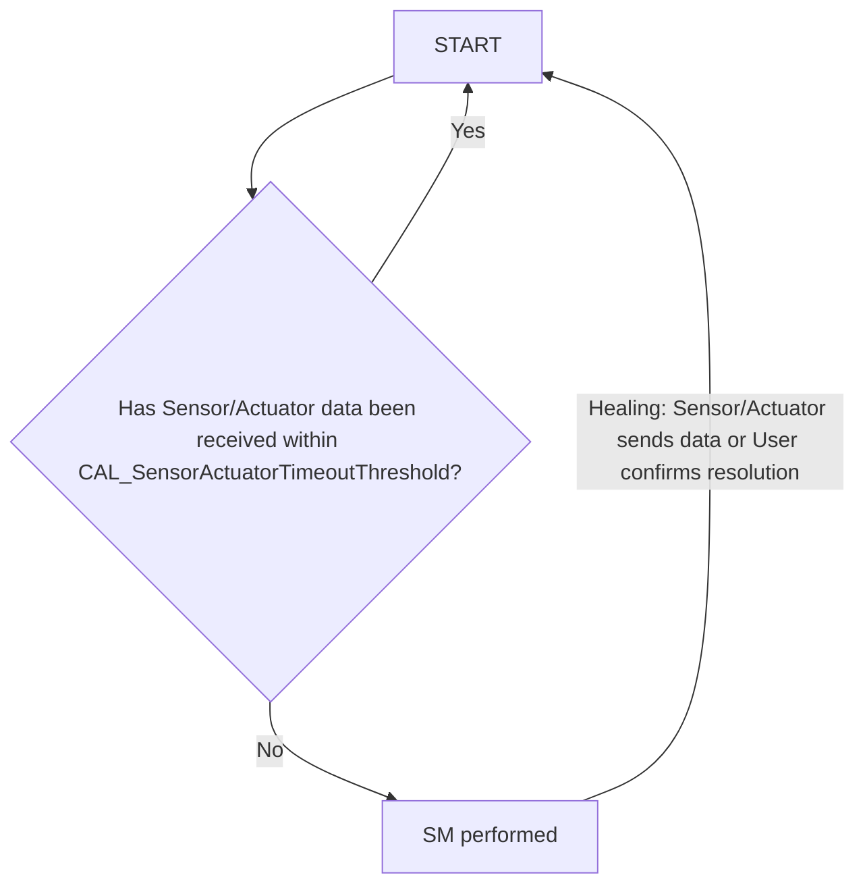
```mermaid
flowchart TD
    A[START] -->| | B{Has Sensor/Actuator data been received within CAL_SensorActuatorTimeoutThreshold?}
    B -->|Yes| A
    B -->|No| C[SM performed]
    C -->|Healing: Sensor/Actuator sends data or User confirms resolution| A

```
    - SM shall be realized by sending a notification based on sensor/actuator type.

##### SM_SMC_1c (Battery Level Monitoring)
```mermaid
flowchart TD
    A[START] -->| | B{Is Sensor/Actuator battery level within CAL_SensorActuatorBatteryLevelThreshold?}
    B -->|Yes| A
    B -->|No| C[SM performed]
    C -->|Healing: Sensor/Actuator battery replaced or recharged or User confirms resolution| A
```
    - SM shall be realized by sending a notification to replace or recharge the battery, and scheduling the next battery replacement or recharge as required.

##### SM_SMC_2 (System Update Reminder)
```mermaid
flowchart TD
    A[START] -->| | B{Is there a System Update available?}
    B -->|No| A
    B -->|Yes| C[SM performed]
    C -->|Healing: System Update performed or User confirms delay| A
```
    - SM shall be realized by sending a notification of level 3

##### SM_SMC_3 (Power Failure Management)
```mermaid
flowchart TD
    A[START] -->| | B{Is there a power outage?}
    B -->|No| A
    B -->|Yes| C{Is a UPS installed and functioning?}
    C -->|No| A
    C -->|Yes| D[SM performed]
    D -->|Healing: Power restored or User confirms resolution| A
```
    - SM shall be realized by sending a notification of level 3

##### SM_SMC_4a (CPU Usage Monitoring)
```mermaid
flowchart TD
    A[START] -->| | B{Is CPU usage within CAL_CPUUsageThreshold?}
    B -->|Yes| A
    B -->|No| C[SM performed]
    C -->|Healing: CPU usage returns to normal or User confirms resolution| A
```
    - SM shall be realized by sending a notification of level 3

##### SM_SMC_4b (RAM Usage Monitoring)
```mermaid
flowchart TD
    A[START] -->| | B{Is RAM usage within CAL_RAMUsageThreshold?}
    B -->|Yes| A
    B -->|No| C[SM performed]
    C -->|Healing: RAM usage returns to normal or User confirms resolution| A
```
    - SM shall be realized by sending a notification of level 3

##### SM_SMC_4c (Disk Space Monitoring)
```mermaid
flowchart TD
    A[START] -->| | B{Is Disk Space within CAL_DiskSpaceThreshold?}
    B -->|Yes| A
    B -->|No| C[SM performed]
    C -->|Healing: Disk Space freed up or User confirms resolution| A
```
    - SM shall be realized by sending a notification of level 3

##### SM_SMC_4d (Hardware Temperature Monitoring)
```mermaid
flowchart TD
    A[START] -->| | B{Is Hardware temperature within CAL_HardwareTemperatureThresholds?}
    B -->|Yes| A
    B -->|No| C[SM performed]
    C -->|Healing: Hardware temperature returns to normal or User confirms resolution| A
```
    - SM shall be realized by sending a notification of level 3

##### SM_SMC_4e  (Ethernet Link Status)
```mermaid
flowchart TD
    A[START] -->| | B{Is Ethernet link active?}
    B -->|Yes| A
    B -->|No| C[SM performed]
    C -->|Healing: Ethernet link active| A
```
    - SM shall be realized by sending a notification of level 3

##### SM_SMC_4f(Local Network Connectivity)
```mermaid
flowchart TD
    A[START] -->| | B{Is router reachable?}
    B -->|Yes| A
    B -->|No| C[SM performed]
    C -->|Healing: Router reachable| A
```
    - SM shall be realized by sending a notification of level 3

##### SM_SMC_4g (Internet Access Management)
```mermaid
flowchart TD
    A[START] -->| | B{Is Internet reachable?}
    B -->|Yes| A
    B -->|No| C[SM performed]
    C -->|Healing: Internet reachable| A
```
    - SM shall be realized by sending a notification of level 3

##### SM_SMC_4h (Internet Latency Monitoring)
```mermaid
flowchart TD
    A[START] -->| | B{Is Internet latency below CAL_InternetLatencyThreshold?}
    B -->|Yes| A
    B -->|No| C[SM performed]
    C -->|Healing: Internet latency below threshold| A

```
    - SM shall be realized by sending a notification of level 3  

##### SM_SMC_4i (Packet Loss Monitoring)
```mermaid
flowchart TD
    A[START] -->| | B{Is packet loss below CAL_PacketLossThreshold?}
    B -->|Yes| A
    B -->|No| C[SM performed]
    C -->|Healing: Packet loss below threshold| A
```
    - SM shall be realized by sending a notification of level 3  

#### **HVAC Monitoring Component:**

**Inputs:**
- Current flow temperature
- Heater/cooler status

**Outputs:**
- Alert to occupants
- HVAC maintenance reminders/actions

**Outputs:**
- The system shall monitor current flow temperature against heater error.

**SM_HMC_1 (Heating/Cooling Flow Monitoring)**

```mermaid
flowchart TD
    A[START] -->| | B{Is the current flow temperature within CAL_THRFlowTemperature?}
    B -->|Yes| A
    B -->|No| C[SM performed]
    C -->|Healing: Flow temperature returns to normal or User confirms resolution| A
```
    - SM shall be realized by sending a notification of level 2  

---
#### 2.1.6 System Calibration values:
---

## 4. System components requirements:
### 3.1 Windows and doors close status
    - Each doors and windows shall have defined safety status for scenarios:
        - Sleep time
        - Vacation (more than 1 day)
        - Out (less than 1 day)
    - External doors shall have defined timeout
    - System shall monitor outside temperature, corresponding room temperature and window status
    - System shall monitor external air pollution and windows status

    - Possible safestates:
        - OPEN - Shall be open
        - CLOSED - Shall be closed
        - NOTIFICATION - Notify current status

    | | Sleep time | Leaving | Vacation |
    | -------- | -------- | -------- | -------- |
    | Bedroom door | CLOSED | CLOSED | CLOSED |
    | Upper bathroom door | CLOSED | CLOSED | CLOSED |
    | Office door | CLOSED | CLOSED | CLOSED |
    | Wardrobe door | CLOSED | CLOSED | CLOSED |
    | Kids Room door | CLOSED | CLOSED | CLOSED |
    | Bathroom door | CLOSED | CLOSED | CLOSED |
    | Garage door | CLOSED | CLOSED | OPEN |
    | Upper bathroom window | NOTIFICATION | NOTIFICATION | CLOSED |
    | Bedroom window | NOTIFICATION | CLOSED | CLOSED |
    | Kids Room window | NOTIFICATION | NOTIFICATION | CLOSED |
    | Office window | NOTIFICATION | NOTIFICATION | CLOSED |
    | Bathroom window | CLOSED | CLOSED | CLOSED |
    | Kitchen window | CLOSED | CLOSED | CLOSED |
    | Living room window | CLOSED | CLOSED | CLOSED |
    | Garage gate | CLOSED | CLOSED | CLOSED |
    | Entrance door | CLOSED | CLOSED | CLOSED |
    | Living Room door | CLOSED | CLOSED | CLOSED |

    #### Priorities
    - External doors dangers are always priority 1
    - All daggers during leaving and vacation conditions are priority 1 except notification cases.
    - Dangers with notification RA are always priority 2
    - Sleep time daggers for windows and door are priority 1 except notification

    ### 3.2 External doors timeouts
    - Dangers shall be active if external doors are open longer than specified in the table.
        - Garage gate: 120s
        - Entrance door: 60s
        - Living Room door: 3h
    #### Priorites
    - External doors dangers are always priority 1

