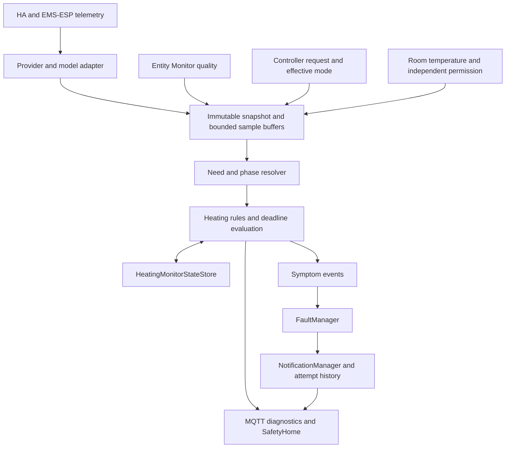

# Heating System Monitoring — Architecture

**Component:** `HeatingSystemMonitorComponent`

**System allocation:** C-HVAC

**Document role:** Normative feature architecture

**Source language:** English

## 1. Purpose and safety allocation

Heating System Monitoring shall supervise the chain from permitted room heat
need through controller request and boiler response to delivered room heat.
Its conclusions shall distinguish observed failures from suspected causes and
from insufficient evidence. An available entity or a running controller shall
not establish effective heating.

Here CH means central heating and DHW means domestic hot water. Carbon monoxide
monitoring remains the independent C-ALARM responsibility.

The controlling documents are:

- [HARA section 1.3.12](<../sys/SafetyConcept - HARA.md#1312-loss-of-heatingcooling>), HZ‑HVAC‑01 / HZ‑HVAC‑LOSS‑01 and SG‑010 / SG‑012;
- [SYS section 8.6](<../sys/SafetyConcept - SYS.md#86-heating-system-monitoring-component-c-hvac>), SYS-SR-HSM-001..018;
- [SSRD section 4.10](<../sys/SafetyComponent - SSRD.md#410-heating-system-monitoring>), SWR-HSM-001..026.

C-HVAC shall contribute heating-health and heating-loss warnings to SG-010/012
and supervision-loss detection to SG-003. It shall retain independent C-TEMP
room-temperature hazard detection and native appliance protection. Its scope
shall exclude cooling, combustion certification and automatic heating control.
Its SS-4 contribution shall be diagnosed degradation, timely notification and
manual guidance; notification acceptance shall not prove physical risk removal.

## 2. Ownership and architecture

| Element | Contract |
| --- | --- |
| Heating telemetry adapter | Own provider/model schema, read lifecycle, cache, source quality, unit normalization and current-code interpretation; expose no household policy or actuator API |
| Entity Monitor (C-ENT) | Evaluate declared input quality and publish Group B diagnostics; preserve shared consumer contracts and suppress duplicate faults only where component ownership is declared |
| `HeatingSystemMonitorComponent` | Own room-need evaluation, phase resolution, heating checks, time budgets, symptom evidence and heating-state reconciliation |
| SmartHeating / boiler controller | Own normal demand generation, operating setpoints and appliance control outside C-HVAC |
| TemperatureComponent (C-TEMP) | Own existing direct/forecast room-temperature safety mechanisms, limits and faults |
| FaultManager | Aggregate all active symptoms per stable fault and publish lifecycle events |
| NotificationManager | Own delivery targets, retries, quiet updates, acknowledgement, notification persistence and bounded attempt history |
| `HeatingMonitorStateStore` | Own durable heating symptom, incident and deadline state separately from delivery state |
| SafetyHome | Present authoritative phase/quality/rule evidence and attempt history; make no heating safety decisions |

No component shall reach into another component's mutable state. Adapter
callbacks and scheduled evaluation shall create immutable input snapshots;
EventBus and explicit read contracts shall carry results. Provider I/O shall
have bounded timeouts and independent schedules. Cached data shall retain its
original observation time and shall not become fresh because it was read again.

C-HVAC shall register no recovery action and shall not issue boiler reset,
climate/setpoint, pump, relay or gas-valve commands. Adapters shall not expose
a write path to the policy engine. Notification transport calls shall remain
owned by NotificationManager. Separate backup/failover authorization shall not
be inferred from an active heating fault.

## 3. Input and dependency contract

Each sample shall identify the semantic signal, installation and source entity,
value, normalized unit, source observation time, receipt time, optional sequence,
quality and interpretation reason. Unsupported, absent, malformed, stale and
contradictory inputs shall remain distinguishable. Temperatures shall use °C,
differences K, rates °C/min and durations seconds. Future timestamps beyond a
calibrated tolerance shall be invalid.

| Signal group | Semantic fields | Use |
| --- | --- | --- |
| Boiler thermal | `flow_temperature`, `return_temperature`, `requested_flow_temperature` | Rise, tracking, distribution and temperature limits |
| Boiler operation | `burner_active`, `pump_active`, `burner_power`, `pump_modulation` | Response, phase and hydraulic consistency; percentage fields have range 0..100 |
| Operating context | `heating_requested`, `dhw_active`, `inhibition_reason`, `inhibition_until`, operating mode | Separate eligible CH evaluation from DHW, overrun and permitted delay |
| Source supervision | transport state, boiler observation timestamp/sequence, adapter quality | Detect unavailable or stale telemetry, including frozen streams |
| Device codes | current service/fault code tuple, model/profile version, maintenance code, historical last error | Distinguish current operating condition, active fault, maintenance and history |
| Independent room need | room temperature, effective comfort target, heating permission, schedule/override, associated installation/circuit | Detect missing request independently of controller output |
| Delivery context | room-temperature samples, relevant configured window/inhibition context | Assess room delivery while retaining C-TEMP authority |
| Optional diagnostics | burner-start counters, runtime counters, DHW temperature/target, pressure when actually supported | Calibrated cycling, maintenance and optional DHW/pressure checks |

The room need inputs shall not depend exclusively on the controller health or
request whose failure is being detected. A shared source shall be identified as
a common-cause limitation in coverage. Permissions shall not be assumed from an
unknown schedule, and no request shall be inferred from a cold room alone when
heating is deliberately disabled. Room need shall use separate activation and
release bands around the effective target.

Each enabled rule shall list all necessary inputs and the hydraulic/circuit
association. Rules without required evidence shall be rejected when enabled;
intentionally disabled optional rules shall expose excluded coverage. A partial
installation shall not report full need-to-delivery supervision. Full CH
coverage requires need, request, response, thermal and quality paths, with a
valid current-code interpretation path for a code-reporting boiler.

### 3.1 Entity Monitor integration

The component shall declare dependencies through the component registration
contract, with stable keys, area, owner, purpose and quality/timing checks.
They shall appear in monitored entities without duplicate `explicit_entities`
entries. Input plausibility shall remain separate from operating-temperature
limits: a plausible numeric reading may still prove an overheating fault.

Boiler-specific feed and measurement dependencies shall use
`fault_owner: component`. C-ENT shall retain their individual diagnostics while
C-HVAC aggregates their impact into supervision loss. Shared C-TEMP/common
inputs shall retain compatible existing fault ownership; C-HVAC shall consume
their quality and shall not emit a second notification for the same root input
failure. Incompatible shared checks/ownership shall be rejected, not silently
overridden. Secondary loss of heating assessment shall remain visible in
coverage without asserting a new mechanical failure.

### 3.2 Freshness and synchronization

IR-008 flow sampling shall be at least 0.2 Hz and samples older than 120 s shall
be invalid. Tighter freshness thresholds shall apply to SG-003 paths as needed
by section 7. HA `last_updated` shall be used only when its integration contract
proves periodic source confirmation, including unchanged readings. Otherwise
an adapter-provided observation timestamp/sequence or heartbeat tied to actual
boiler reception shall be required. MQTT connectivity alone proves neither
boiler availability nor freshness.

Repeated sequence/timestamp samples shall not expand trend coverage. A new,
independently confirmed unchanged value may count as a sample. Evaluation shall
reject excessive cross-signal skew and sample gaps; interpolation across a gap
shall not supply failure or recovery evidence. Rate windows shall use source
time, while runtime durations shall use a monotonic clock. Receipt time shall
support latency diagnosis, not replace the original observation time.

## 4. Operating phase and supervision coverage

| Raw phase | Required interpretation |
| --- | --- |
| `idle` | Fresh evidence establishes no applicable heat request and no conflicting boiler activity |
| `starting` | A valid unsatisfied request is inside the bounded startup interval |
| `heating` | Fresh coherent signals establish CH heating; a request alone is insufficient |
| `dhw` | The equipment profile positively identifies DHW production and its routing/priority |
| `pump_overrun` | Pump activity follows burner shutdown within the permitted overrun interval |
| `inhibited` | An identified permitted inhibition is active with an explicit bounded deadline |
| `unknown` | Missing/contradictory evidence prevents a justified phase decision |

For a single-circuit boiler, confirmed DHW routing shall take precedence over
CH performance evaluation, followed by CH heating, starting, permitted
inhibition, overrun and idle. A simultaneous-operation profile shall explicitly
define independent circuits instead. Contradictions outside that profile shall
yield `unknown`; an active fault shall never be hidden by the phase choice.

Supervision health shall separately use `healthy`, `degraded` or `unavailable`.
Healthy supervision means its selected inputs/rules are evaluable, not that the
boiler has no active fault. Coverage shall enumerate enabled, disabled, shadow,
applicable and unevaluable rules. Each unknown/inhibited result shall carry a
reason and, where applicable, an expiry/deadline.

## 5. Rules, fault identities and evidence

Mechanism IDs shall be stable and each mechanism shall map to exactly one
fault. A fault shall aggregate symptoms from all affected installations/rooms.
Installation and room keys shall be validated alphanumeric identifiers;
generated symptom IDs shall use separators and reject collisions. For a
mechanism whose suffix after `sm_hsm_` is
`<RuleKey>`, symptom IDs shall be `Heating_<RuleKey>_<InstallationKey>` or
`Heating_<RuleKey>_<InstallationKey>_<RoomKey>` for room-specific rules.

| Rule | Mechanism ID | Fault ID / level | Failure evidence and eligibility | Positive recovery evidence |
| --- | --- | --- | --- | --- |
| R01 | `sm_hsm_supervision_loss` | `HeatingSupervisionLoss` / L3 | Required boiler feed/measurement or interpretation invalid beyond allocated time; independent of demand | Every constituent failed cause/path demonstrably valid for its own recovery interval |
| R02 | `sm_hsm_device_fault` | `HeatingDeviceFault` / L3 | Fresh current code classified as an active device fault by the model profile | Fresh positive non-fault classification maintained for recovery interval |
| R03 | `sm_hsm_missing_demand` | `HeatingMissingDemand` / L3 | Permitted room need remains unmet without controller request beyond allowance | Valid request for persisting need, or positively restored room target, maintained for recovery interval |
| R04 | `sm_hsm_no_response` | `HeatingNoResponse` / L3 | Unsatisfied issued request without the expected boiler response after bounded inhibitions/startup | Fresh eligible response or already-achieved flow target maintained for recovery interval |
| R05 | `sm_hsm_no_flow_rise` | `HeatingInsufficientOutput` / L3 | Burner operating, large target deficit, insufficient measured rise over eligible window | Adequate rise or sustained achievement of flow target during eligible operation |
| R06 | `sm_hsm_flow_tracking` | `HeatingInsufficientOutput` / L3 | Persistent flow deficit outside target-tracking tolerance after startup | Flow inside the narrower recovery band for the recovery interval |
| R07 | `sm_hsm_pump_mismatch` | `HeatingDistributionSuspected` / L3 | Burner active with the topology-required pump off beyond startup tolerance | Valid pump/burner relationship during a comparable eligible heating interval |
| R08 | `sm_hsm_flow_return` | `HeatingDistributionSuspected` / L3 | Sustained excessive or inconsistent flow/return response under suitable load | Differential and response return to validated bands under comparable load |
| R09 | `sm_hsm_room_delivery` | `HeatingRoomDeliveryInsufficient` / L3 | Sustained room cooling with permitted need and confirmed heat delivery attempt | Room trend recovers under heat demand or room positively reaches recovery target |
| R10 | `sm_hsm_mode_overtemperature` | `HeatingExcessTemperature` / L2 | Valid temperature exceeds active-mode envelope including hysteresis and tolerance | Valid temperature below the applicable clear threshold for recovery interval |
| R11 | `sm_hsm_absolute_overtemperature` | `HeatingExcessTemperature` / L2 | Valid temperature exceeds manufacturer absolute bound in any mode, including unknown phase | Valid temperature below absolute recovery bound for recovery interval |
| R12 | `sm_hsm_short_cycling` | `HeatingCyclingDiagnostic` / L4 | Excess starts and short cycles in a sufficiently covered, mode-specific observation window | A sufficiently covered comparable operating window meets recovery limits |
| R13 | `sm_hsm_maintenance` | `HeatingMaintenance` / L4 | Fresh model-supported maintenance indication | Explicit fresh manufacturer-defined maintenance-clear condition |

R01 shall expose separate reasons for transport, telemetry timeout, invalid
measurement, interpretation and component persistence failure. Missing shared
room inputs with another fault owner shall follow section 3.1 instead of
duplicating that owner's alarm. Unknown current codes shall make R02
unevaluable and trigger interpretation coverage loss; they shall not be mapped
to a device fault or a healthy boiler by default. Code profiles shall contain
equipment applicability and source-document/version provenance. Historical
error strings, including malformed dates, shall be diagnostic only.

R01 shall maintain a bounded cause ledger within each installation symptom.
Each constituent cause shall retain its own failure/recovery latch and timing;
recovering communication shall not clear a still-invalid measurement, unknown
code interpretation or persistence failure. The installation symptom shall
clear only when every active constituent cause has positively recovered.

R03 shall group room evidence by its actual installation/circuit. R04 shall
consider a target already met, burner restart hysteresis, anti-cycle inhibition
and DHW priority. R05/R06 shall require eligible windows after target changes;
target/phase changes may invalidate a sample window but shall not erase the
total unresolved-need deadline. Continuous or repeated inhibition that exhausts
the heating-loss budget shall set R04 with the reason `inhibition_budget_exhausted`.

R08 shall not fault on a small or inverted differential at idle, nor on a small
differential at low load alone. R09 shall distinguish a delivery symptom from
a proved boiler defect and account for room thermal inertia and declared
ventilation/inhibition. C-TEMP shall still detect unsafe room temperatures even
when C-HVAC's delivery check is inhibited or unevaluable.

R10 shall not apply a CH-only limit while heating DHW. Its envelope shall include
configured operating maximum, native hysteresis and measurement tolerance;
R11 shall never be disabled by demand, normal startup or DHW priority. An invalid
temperature cannot prove overtemperature and shall instead create quality loss.
Thresholds shall be validated against the model and hydraulic installation.
Quality/plausibility bounds shall admit physically representable temperatures
above operational and absolute fault thresholds so an upstream range check
cannot mask R10/R11. Values invalid under the sensor's physical contract shall
remain quality faults; a valid dangerous temperature shall produce the thermal
fault even when it exceeds normal controller limits.

R12 shall separate CH and DHW cycles. Counter reset/wrap shall establish a new
baseline without generating a burst of starts; unavailable coverage shall not
count as a zero-start healthy interval. Optional DHW performance and pressure
rules shall require their own explicit input, timing, fault and verification
contract before enablement; DHW phase handling shall remain required for CH
eligibility when the boiler supplies DHW.

## 6. Rule lifecycle, incident correlation and restart

Rule evaluation shall use `not_applicable`, `unevaluable`, `passing`,
`pending_failure`, `failed` and `pending_recovery`, with a separate active
symptom latch. A result shall retain current applicability, reasons, observed
values and their ages. An inactive rule shall SET only after its failure
predicate and required valid observation duration are satisfied.

On missing evidence, pending recovery shall be cancelled. Pending sample-based
failure evidence shall cease accumulating and a coverage fault shall observe
its own deadline. The unresolved-need deadline shall continue to account for
elapsed time; coverage loss shall not be turned into invented mechanical
failure evidence. An active symptom shall remain latched and publish a recovery
wait reason if it cannot presently be tested.

An active performance symptom shall not clear because demand ends, a schedule
changes or communications recover. Rule-specific passing evidence in section 5
shall be required for HEAL. Positive target attainment is evidence; an unknown
target, disabled schedule or remembered value is not. Mode changes shall be
recorded in evidence and shall not silently reinterpret old samples under a new
threshold. Acknowledgement affects notification repetition only.

For each fault's inactive-to-active transition the component shall allocate an
opaque incident UUID. All contributing installation/room symptoms, context
updates and eventual HEAL shall retain that UUID until every symptom has
positively cleared. A subsequent recurrence shall get a new UUID; the existing
stable notification tag shall remain tied to the fault ID. Symptom clears while
other symptoms remain shall update context quietly without a false HEAL.

`HeatingMonitorStateStore` shall atomically persist a bounded versioned snapshot
outside the deployed application tree. It shall contain active symptom latches,
incident UUIDs, first observed failure/need times, remaining or consumed budget,
last qualified evidence, schema version and calibration fingerprint. Maximum
record count, evidence size, checkpoint period and event-write policy shall be
validated. Write failure shall expose supervision degradation and shall not
block evaluation, notifications or other components.

On reload, active symptoms shall be reintroduced through the authoritative
FaultManager path before healthy supervision is published. Saved measurements
shall remain historical evidence until revalidated. Downtime shall consume
remaining deadlines but shall not count as valid heating/recovery samples. An
expired coverage deadline shall be reported immediately after reconciliation;
a physical performance fault shall still require justified evidence.

Clock rollback, unknown downtime, corrupt/missing state after prior operation
or incompatible calibration shall preserve known incidents and expose recovery
verification as unknown. The runtime shall reconcile with any restored active
notification identities and shall not send HEAL based on an empty store. A
fresh installation shall be distinguishable by an initialization marker;
ambiguous state shall fail to degraded supervision. Lost observation history
shall require rebuilding sample windows while coverage remains explicit.
Clock uncertainty shall consume the remaining deadline conservatively instead
of granting another full grace period. Repeated restart shall not extend the
supervision guarantee.

## 7. Calibration and timing allocation

All operating thresholds shall be calibration values with source, units,
equipment applicability and validation evidence. Manufacturer absolute limits
shall be required for the absolute-temperature rule; a generic 90°C bound shall
not be labeled the safe operating maximum of an unidentified appliance.
Plausibility ranges, operational thresholds and recovery bands shall be
separate. Historical tuning shall not relax manufacturer limits or SG budgets.

| Calibration group | Required parameters |
| --- | --- |
| Input quality | freshness source and maximum age, unit conversion, plausibility bounds, maximum skew and future-time tolerance |
| Evaluation | cadence, valid sample count, minimum observed window coverage, maximum sample gap, startup allowance |
| Need and request | need activation/release bands, permitted modes, room-to-circuit association, missing-demand/response deadlines |
| Performance | minimum rise, target deficit enabling rise check, tracking failure/recovery bands, phase/load eligibility |
| Distribution | hydraulic pump expectation, load qualification, differential bounds, room-trend window and recovery target |
| Temperature limits | mode envelopes, native hysteresis, tolerance, manufacturer absolute bound, clear hysteresis |
| Inhibition | recognized reasons, maximum individual and cumulative allowance, unresolved-need deadline |
| Lifecycle | failure/recovery durations, incident/evidence limits, checkpoint policy, startup reconciliation bound |
| Diagnostics | CH/DHW cycle window and count/duration criteria, minimum operating coverage, maintenance code profile |

The following are calibration-study examples, not universal defaults or
manufacturer guarantees: a 2°C minimum rise over 5 min when deficit exceeds
10°C; tracking deficit over 10°C for 15 min; differential over 25 K for 5 min
under qualified load; more than 6 starts/h across three covered hours. Each
requires installation evidence and a separately defined recovery band/time.
Short-cycling observation shall not delay loss-of-heating alarms.

For each path, the validator shall calculate worst-case elapsed time from its
defined fault onset to decision/notification, accounting for sequential stages
and the maximum of explicitly concurrent stages. Startup, sample windows,
inhibitions, evaluation cadence and debounce shall be included once each. The
decision/evidence shall expose the actual onset used; onset shall not be moved
forward because detection was delayed.

| Safety path | Limit | Example bounded allocation |
| --- | --- | --- |
| SG-003 required telemetry loss | 60 s | 15 s heartbeat timeout + 5 s failure confirmation + 5 s evaluation latency + 1 s decision + 30 s HA notification acceptance = 56 s |
| SG-010/012 unresolved heating need | 1800 s | 300 s total startup/inhibition allowance + 900 s observation + 60 s confirmation + 5 s evaluation + 1 s decision + 30 s acceptance = 1296 s |

The first example requires a source that meets its heartbeat contract; a
120-second freshness allowance cannot fit a 60-second supervision path.
The 120-second IR-008 limit remains an upper validity bound, not permission to
extend the SG-003 deadline. A profile that cannot meet source rate/timing shall
fail safety-path validation or expose explicitly excluded coverage, never
report compliance through a larger silent timeout.

Observation windows shall include startup/inhibition exactly as specified by
each rule. The total unresolved-need timer shall bound accumulated permissible
delays across changing phases. A rule with insufficient samples at its deadline
shall produce lost coverage, not a fabricated heating fault. Notification
deadline misses shall be reported by the delivery manager; no acceptance or
resident response time shall be assumed when transport is unavailable.

Excess-temperature timing shall use the HSM-H05 equipment thermal allocation.
Its reviewed profile shall identify the allocation as
`HSM-H05/<EquipmentProfileKey>`, manufacturer/hydraulic evidence, maximum total
response time and detection/decision/notification portions. Enablement of
R10/R11 shall be rejected without that reviewed bound. Neither the heating-loss
30-minute budget nor the occupied-room SG-004 budget shall be inherited as an
appliance thermal bound. Supervision grace shall not inhibit a valid absolute
overtemperature reading or a confirmed current blocking code.

## 8. Configuration ownership and validation

The configuration contract shall preserve the repository's two-source model:

| Source | Heating responsibility |
| --- | --- |
| `backend/config/system_config.yml` | Component rule definitions, calibration, model/code profiles, fault mapping/severity, evidence limits and persistence policy |
| `backend/config/user_config.yml` | Component/installation selection, stable installation/room keys, entity and area bindings, equipment/profile identity and hydraulic topology selection |
| `backend/app_cfg.yaml` | Generated validated deployment artifact; no independent policy or manual edits |

Equipment profile selection shall bind an installation to a reviewed system
profile, not let a user binding redefine manufacturer limits or code semantics.
The compiler shall construct installations from explicit user selection so a
deleted installation cannot survive as a default. Calibration overrides shall
preserve the same ownership rules as other components.

Validation shall reject unknown fields, ambiguous key generation, missing
enabled-rule inputs, incompatible units, invalid profiles/topology, inverted
thresholds, recovery bands that cannot demonstrate recovery, unbounded sample
storage, incompatible shared dependency ownership, unsafe timing combinations
and inconsistent phase capabilities. Diagnostics-only or shadow rules shall be
explicitly excluded from active safety coverage. Deployable configuration
shall not claim an enabled safety rule merely because a binding exists.

## 9. Fault, notification and diagnostic presentation

Each transition shall produce bounded structured evidence: `incident_id`, fault
and symptom IDs, rule ID, installation/room, UTC onset/evaluation/transition
times, phase and inference reason, independent need and request, input values
and units, observation age/quality, trend/window coverage, active thresholds,
elapsed and remaining budget, current code/classification/profile version,
inhibitions and recovery evidence. Only configured allowlisted context shall
enter notification payloads or durable notification state.

SET shall explain what was observed and its consequence. HEAL shall include the
original incident identity, duration and the measured reason it is now clear.
The existing raw fault lifecycle shall remain `Set`, `Shadowed`, `Cleared`,
`Not_tested`; notification journal states shall remain `SET`, `SHADOWED`,
`CLEARED`. HEAL is presentation/domain terminology for a positively cleared
incident, not a new raw state. Shadowing and acknowledgement shall not heal.

NotificationManager shall retain explicit configured targets, per-target
attempt/result, bounded retries and quiet same-fault updates. Its latest-100
attempt journal shall be enriched compatibly with bounded incident correlation;
legacy entries without heating context shall remain readable. Queued delivery
without an actual attempt shall not create an attempt record. An accepted HA
service call shall be labeled `accepted_by_home_assistant`, not confirmed phone
delivery. A notify group shall not be expanded into inferred recipient people.
Incident evidence and submission history shall remain distinct; the bounded
journal shall not be described as a complete incident archive.

Per-installation diagnostics shall use
`sensor.heating_system_<installation_key>` with a validated snake-case key.
The state shall represent supervision health; attributes shall expose phase,
coverage, active fault references and bounded rule results with reasons and
input ages. State publication shall use the shared MQTT discovery/availability
contract. Unavailable app/transport state shall remain visible separately from
the last diagnostic attributes.

SafetyHome shall show a readable heating summary and a details view containing
failed, pending and unevaluable checks, current/requested temperatures,
measurement age, phase, inhibition expiry and the evidence needed for recovery.
It shall link heating incidents to filtered notification attempts while
preserving the notification-history-before-entity-history ordering. EN/PL/DE
labels and notification templates shall have equivalent meaning; stable IDs,
codes and timestamps shall remain language-independent. UTC evidence shall be
rendered with the user's local date, time and timezone.

## 10. Verification and traceability

Tests shall use controlled time, provider fixtures and the bundled AppDaemon
stub. Passive installation evidence shall calibrate thermal windows and code
profiles. No household heating/actuator routine shall be triggered merely to
verify documentation or backend unit behavior.

| Test group | Required scenarios | Software requirements |
| --- | --- | --- |
| HSM-V01 Input contracts | Finite/invalid values, units, future/out-of-order samples, duplicates versus fresh unchanged observations, skew/gaps, cached connected state and lost heartbeat | SWR-HSM-001/002/003/004/009 |
| HSM-V02 Independent need | Missing controller demand despite permitted cold room; disabled schedule; unknown target; common-cause inputs; two installations and correct room/circuit routing | SWR-HSM-005/008/024 |
| HSM-V03 Phase and eligibility | Idle at target, startup, DHW priority, anti-cycle, pump overrun, contradictory signals and mode change; valid above-absolute readings still reach the thermal rule despite normal controller limits | SWR-HSM-006/007/008/011 |
| HSM-V04 Performance | Adequate/inadequate rise, tracking deficits, target changes, delayed pump, normal idle differential, suspected blocked distribution, sustained room cooling and successful recovery | SWR-HSM-009/010/011/015 |
| HSM-V05 Codes and counters | Operating/maintenance/current fault/unknown codes, historical error with malformed date, profile mismatch, reset/wrap/replay, mode-separated cycles | SWR-HSM-002/012/013 |
| HSM-V06 Lifecycle and ownership | Transient failure, exact SET/HEAL boundary, missing data during recovery, vanished demand, two symptoms or two R01 causes with only one recovered, loss of shared feed, C-TEMP independence and duplicate C-ENT suppression | SWR-HSM-003/014/015/016/017 |
| HSM-V07 Deadlines | Sampling/evaluation/debounce boundaries, total 60 s and 1800 s paths, prolonged/repeated inhibition, fresh-start budget and notification deadline miss | SWR-HSM-007/018/026 |
| HSM-V08 Restart and time | Restart in each pending/active/recovering state, repeated restart, corrupt/missing/version-mismatched snapshot, calibration change, unavailable store, clock rollback/forward jump and downtime without positive recovery | SWR-HSM-019/020/026 |
| HSM-V09 Evidence and UI | SET/context/HEAL incident correlation, per-target retries, accepted-versus-delivered semantics, legacy journal compatibility, bounded data, local timestamp and EN/PL/DE rendering | SWR-HSM-021/022/023 |
| HSM-V10 Boundaries | Invalid configuration, absent thermal allocation or masking plausibility limits, excluded/shadow coverage, removed installation, bounded buffers and slow adapters, zero boiler/pump/climate/reset or recovery calls even on reload | SWR-HSM-024/025/026 |

| SYS requirement | Refinement in SSRD |
| --- | --- |
| SYS-SR-HSM-001 | SWR-HSM-001/005/008 |
| SYS-SR-HSM-002 | SWR-HSM-003/024 |
| SYS-SR-HSM-003 | SWR-HSM-002/012 |
| SYS-SR-HSM-004 | SWR-HSM-006/007 |
| SYS-SR-HSM-005 | SWR-HSM-003/004/014/017 |
| SYS-SR-HSM-006 | SWR-HSM-005/007/008 |
| SYS-SR-HSM-007 | SWR-HSM-007/009 |
| SYS-SR-HSM-008 | SWR-HSM-010 |
| SYS-SR-HSM-009 | SWR-HSM-011 |
| SYS-SR-HSM-010 | SWR-HSM-012/013 |
| SYS-SR-HSM-011 | SWR-HSM-014/015 |
| SYS-SR-HSM-012 | SWR-HSM-007/018/020 |
| SYS-SR-HSM-013 | SWR-HSM-019/020 |
| SYS-SR-HSM-014 | SWR-HSM-016/017 |
| SYS-SR-HSM-015 | SWR-HSM-021/022 |
| SYS-SR-HSM-016 | SWR-HSM-023 |
| SYS-SR-HSM-017 | SWR-HSM-024 |
| SYS-SR-HSM-018 | SWR-HSM-025/026 |

Integration shall preserve the
[Entity Health Monitoring contract](<Entity Health Monitoring - Architecture.md>),
[Mobile Notification Delivery contract](<Mobile Notification Delivery - Architecture.md>)
and [Recommended Actions and Recovery boundary](<Recommended Actions and Recovery - Architecture.md>).
Verification evidence shall distinguish requirement coverage from runtime
implementation and from passive or controlled installation validation.
