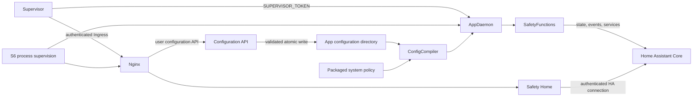

# Home Assistant App Architecture

## 1. Purpose

The Home Assistant App is the deployment boundary for SafetyComponent. It
packages the AppDaemon runtime, SafetyFunctions backend, and Safety Home
frontend as one versioned artifact with one installation, configuration,
backup, update, and rollback lifecycle.

AppDaemon remains the backend execution environment. It is not a separately
installed or operator-managed dependency of the resulting App.

## 2. Runtime structure

The image contains immutable backend source, system policy, frontend assets,
and runtime service definitions. Installation-owned configuration and runtime
state remain outside the image in the App-specific configuration directory.

## 3. Configuration boundary

The App uses two editable sources and one generated runtime configuration:

- packaged `system_config.yml` owns software policy, calibration, fault
  definitions, provider lifecycle, and stable technical contracts;
- App-specific `user_config.yml` owns component selection, language,
  notification destinations, optional installation-wide default overrides,
  and a normalized registry of site data, rooms, openings, detectors,
  monitored entities, and Home Assistant bindings;
- the compiler creates the AppDaemon `apps.yaml` inside the ephemeral runtime
  directory on every start.

The compiler resolves system defaults, installation defaults, and per-asset
overrides in that order. It then generates the existing component-specific
runtime bindings. Physical assets are declared once, so one opening entity can
serve multiple component roles without duplicated installation data. The
[Configuration Model architecture](<Configuration Model - Architecture.md>)
defines the complete editable schema and version policy.

The Home Assistant App configuration tab owns shallow operational settings,
such as log level. Safety Home owns the editor for `user_config.yml`, including
component selection, notification destinations, installation defaults, and
the physical asset registry. The editor uses a same-origin API available only
through authenticated Ingress. It performs model and compiler validation and
uses revision-checked atomic writes. It does not expose or mutate the packaged
`system_config.yml`.

A successful save persists the source but does not alter the running safety
configuration. The operator restarts the App to execute the normal startup
compiler and live Home Assistant validation as one controlled initialization.

On first start the App writes `user_config.example.yml` as
`user_config.yml` and exits. This prevents example entity bindings from being
treated as reviewed installation evidence.

## 4. Frontend and Ingress

Nginx serves the built Safety Home assets on the internal Ingress port. The
port is not published to the host. Network policy accepts Supervisor Ingress
traffic and local process-health probes and rejects other container-network
clients.

The App declares:

- `ingress: true` for authenticated access through Home Assistant;
- `panel_title: Safety Home` for the sidebar label;
- `panel_icon: mdi:alarm-light` for the sidebar siren icon;
- `panel_admin: true` so the private installation editor and safety panel are
  restricted to Home Assistant administrators.

Frontend assets use relative paths so the same build works under the dynamic
Ingress prefix and the legacy `/local/SafetyHome/` compatibility deployment.
Client-side navigation remains fragment-based and does not require server-side
route knowledge.

Nginx proxies only `/api/config` to a loopback-only configuration service. The
service returns the private editable source to the authenticated browser and
never returns Supervisor credentials, packaged system policy, generated
runtime configuration, or persistence state.

## 5. Home Assistant communication

The App requests `homeassistant_api: true`. AppDaemon authenticates through the
Supervisor-injected token and connects to Home Assistant Core through the
Supervisor boundary. No long-lived access token is stored in the image,
repository, App options, or browser bundle.

Safety Home continues to use the authenticated Home Assistant frontend
connection for state, history, service, and event access. The Supervisor token
shall never be exposed to frontend JavaScript.

## 6. Persistence and backup

The App-specific configuration directory contains:

- `user_config.yml`;
- `appdaemon/notification_state.json`;
- `appdaemon/recovery_state.json`;
- `appdaemon/internal_environment_state.json` when that component is enabled.

Cold backup mode stops the App while Supervisor captures these files. Generated
runtime code, compiled `apps.yaml`, AppDaemon runtime configuration, and
frontend assets are image-owned or ephemeral and are recreated after restore.

## 7. Functional self-monitoring boundary

Self-monitoring is part of the App runtime rather than a separate Safety
Component:

- S6 supervises AppDaemon, the configuration API, and Nginx independently;
- a non-zero exit of either required service terminates the container so
  Supervisor can observe and restart the failed App, while a clean exit remains
  under S6 restart supervision;
- the Supervisor watchdog checks the internal Ingress listener;
- `sensor.safety_app_health` reports backend initialization and validated
  runtime health;
- Entity Health Monitoring checks configured Home Assistant dependencies;
- MQTT availability and heartbeat distinguish an absent backend from a healthy
  safety state.

These mechanisms cover process loss, initialization failure, configuration
failure, Home Assistant dependency failure, and missing heartbeat. A live
process or reachable web port is not positive evidence that all safety logic is
correct. Semantic checks, dependency checks, and fault diagnostics remain
independent and shall not be replaced by the container watchdog.

## 8. Safe migration

Only one SafetyFunctions backend may own the stable MQTT entities and Home
Assistant listeners at a time. Migration shall preserve the reviewed
`user_config.yml` and, when lifecycle continuity is required, the three JSON
state files. The separate AppDaemon-hosted SafetyFunctions instance shall be
stopped or removed before the standalone App starts.

Running both instances concurrently is prohibited because duplicate listeners
can duplicate notifications and recovery handling, while both publishers would
contend for the same stable MQTT discovery and state topics.

## 9. Build and release

The image build uses the repository root as its context so backend and frontend
sources remain canonical and are not duplicated under the App directory. The
multi-stage image build compiles Safety Home with Node.js and installs the
version-pinned AppDaemon runtime on a Home Assistant Python base image.

Release tags shall match the version in `safety_component/config.yaml`.
Per-architecture `amd64` and `aarch64` images are combined into the generic
`ghcr.io/arkaqius/safetycomponent:<version>` manifest consumed by Supervisor.
