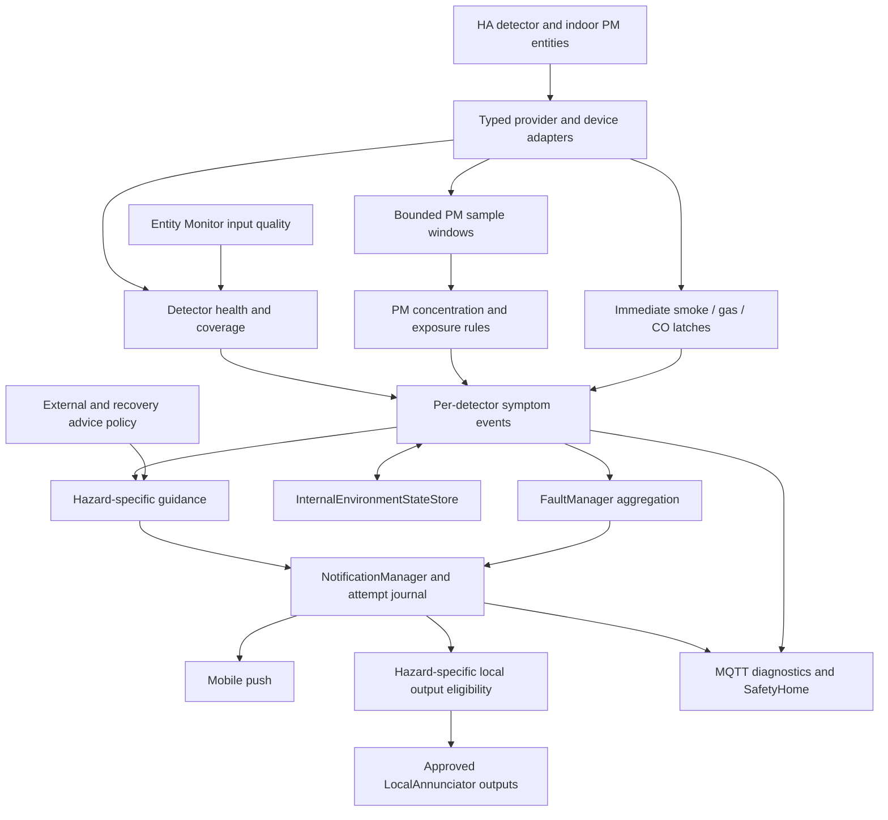

# Internal Environmental Hazard Monitoring — Architecture

**Component:** `InternalEnvironmentalHazardMonitorComponent`

**Logical allocations:** C-ALARM (smoke, flammable gas, CO); C-AQ (indoor PM2.5)

**Document role:** Normative feature architecture, English source language

## 1. Purpose and allocation

The component shall report asserted smoke, flammable-gas and carbon-monoxide
alarms and elevated measured indoor PM2.5. It shall preserve separate hazard,
detector-health and evidence-quality state. It shall not infer that a home is
safe merely because no detector currently reports an alarm.

The controlling contracts are
[HARA section 1.3](<../sys/SafetyConcept - HARA.md#13-safety-goals>),
[SYS section 8.7](<../sys/SafetyConcept - SYS.md#87-internal-environmental-hazard-monitoring-c-alarm-and-c-aq>)
and [SSRD section 4.11](<../sys/SafetyComponent - SSRD.md#411-internal-environmental-hazard-monitoring>).
HARA hazards HZ‑FIRE‑01, HZ‑GAS‑01, HZ‑CO‑01, HZ‑AQ‑01 and
HZ‑SYSTEM‑FAIL‑01 establish SG‑003 and SG‑005..008. One component shall
implement the two logical allocations without merging their safety priorities.

Autonomous detector sounders and manufacturer alarm algorithms shall remain
independent of HA, MQTT, AppDaemon and mobile transport. Numeric CO/gas
concentrations shall supplement the detector alarm, not replace its certified
or manufacturer-defined concentration/time behavior. PM2.5 shall not be used
as a smoke, CO, CO2 or combustible-gas detector. Outdoor pollution monitoring
shall remain with ExternalHazardComponent.

The component shall observe and notify. Gas cutoff, ventilation, purification,
opening/lock control, detector hush/reset and safe re-entry authorization shall
not be its recovery actions. Any emergency actuator allocation shall be
separately justified for the hazard and installation. Shared notification
outputs shall be constrained by section 7, not treated as an exemption.

## 2. Architecture and ownership

| Element | Responsibility |
| --- | --- |
| Input adapter | Own device/provider state mapping, unit/schema validation, source freshness and read lifecycle; no household threshold or actuator logic |
| Immediate alarm evaluator | Latch every observed valid binary assertion before slower work; retain independent detector identity |
| PM evaluator | Calculate bounded time-aware metrics and apply concentration/exposure policies |
| Entity Monitor integration | Declare Group B inputs and expose quality; compatible component ownership prevents duplicate input-health faults |
| Incident coordinator | Publish symptoms, retain cause ledgers and recovery evidence, reconcile restart state and fault-episode identity |
| FaultManager / NotificationManager | Retain aggregation, raw lifecycle, delivery, acknowledgement, retry and quiet-update contracts |
| `InternalEnvironmentStateStore` | Persist domain symptom/timing state separately from delivery persistence |
| Guidance/output policy | Resolve hazard-specific advice and electrical-output eligibility before shared adapters act |
| SafetyHome | Display authoritative evidence, coverage, source health and notification attempts; no browser-side safety decisions |

The immediate alarm path shall not await PM averaging, network reads,
persistence, history rendering or another detector. Adapters shall isolate
provider I/O with bounded timeouts and expose immutable normalized observations.
PM and persistence workloads shall be bounded so they cannot starve binary
callbacks. Storage or transport failure shall not block local symptom state.

## 3. Inputs, device profiles and supervision

Each configured subject shall have an alphanumeric `DetectorKey`, indoor
`area_id`, resolved friendly name, equipment/profile identity and one or more
typed hazard channels. A combined smoke/CO device shall expose separate channels
with distinct symptom identities. A detector shall belong to its actual area;
co-located sensors shall not be averaged into one binary vote.

| Channel | Required semantics | Optional evidence |
| --- | --- | --- |
| `smoke` | Explicit alarm/clear states and source confirmation contract | Trouble, battery, end-of-life and test/hush flags |
| `flammable_gas` | Explicit alarm/clear states and declared gas identity, such as methane or LPG, according to equipment profile | Concentration with gas-specific unit and interpretation |
| `carbon_monoxide` | Explicit alarm/clear states and source confirmation contract | CO concentration in ppm and detector status |
| `pm25` | Indoor PM2.5 concentration in µg/m³, valid range, source observation time and quality | Humidity/calibration, saturation indication and device status |
| Health | Available trouble/availability and trustworthy heartbeat/link supervision contracts | Battery, self-test capability, maintenance/end-of-life indication |

Every observation shall retain source entity, hazard/channel, value and unit,
observation and receipt timestamps, optional sequence, freshness basis, quality
and interpretation reason. State sets shall be explicit and disjoint. Profile
normalization shall not treat all nonempty strings as truthy or all non-`on`
values as clear. Unknown states shall remain unevaluable.

Configured profiles shall identify manufacturer/integration provenance for
alarm, clear, test and hush behavior. Self-test or maintenance state shall not
erase a live alarm. A test shall be distinguishable only through an explicit
trusted test contract; an ambiguous assertion shall remain a live alarm. No
routine shall trigger a physical detector test as part of software validation.

The component shall register required Group B dependencies with entity/area,
purpose, checks and fault ownership. Component-owned input failures shall use
`InternalEnvironmentalDetectorUnavailable`; C-ENT shall continue publishing
the individual health records. Shared consumer contracts shall retain their
compatible ownership. An alarm entity shall not be declared healthy only when
its value is `off`: detecting a hazard is successful detector operation.

### 3.1 Alarm evidence and quality precedence

A fresh, correctly mapped assertion shall immediately SET even if a separate
battery/trouble signal is failing. Quality loss cannot prove an environmental
alarm, but it also cannot erase a previously observed one. Malformed or
unauthenticated assertion payloads shall not become confirmed alarms.

At startup an authoritative fresh asserted state shall SET immediately after
its binding is validated. An unconfirmed retained positive state from the
configured source shall conservatively create or retain an L1 incident marked
`unverified_assertion`; its message shall explicitly state that current alarm
status is awaiting confirmation. It shall not be presented as a fresh detection.
A replay older than a known authoritative clear shall not reopen an incident.
Retained clear data shall never supply positive recovery evidence.
The same reconciliation shall run after reconnect, resubscription or recovery
from an observation gap, not only at process startup. Each channel shall retain
its last authoritative clear ordering watermark across incident closure and
restart. Ordering shall use profile-defined source epochs/sequences or trusted
source time, not receipt time; an epoch reset shall not be compared as an older
sequence. Without provable ordering, a positive retained state shall remain an
unverified assertion rather than being discarded as replay.

Binary event streams shall latch the assertion edge before processing a later
clear so rapid transitions cannot disappear between polling snapshots. Profile
evidence must distinguish delivery duplicates from a new detector assertion.
Out-of-order and future-dated messages shall be diagnosed; they shall not
overwrite newer authoritative state or advance a clear timer.

### 3.2 Availability and temporal coverage

HA `last_changed` is not a heartbeat. `last_updated` shall establish freshness
only with a verified integration contract for unchanged source reports. A
detector-specific heartbeat, last-seen sequence or genuinely supervised link
shall otherwise establish current coverage. An online MQTT broker alone shall
not prove that a wireless detector is online.

IR-002..004 require alarm edges within 1 s and supervised confirmation within
60 s. IR-007 requires PM sampling at least 0.2 Hz with age at most 120 s. Tighter
supervision thresholds shall be selected to fit the full SG-003 budget. A
profile unable to meet those source contracts shall expose excluded/degraded
coverage rather than silently extend the safety guarantee.

## 4. Mechanisms, faults and priorities

Each mechanism shall map to one stable fault. Symptom IDs shall be
`InternalEnv_<RuleKey>_<DetectorKey>`, with `RuleKey` equal to the mechanism
suffix after `sm_iehm_`; generated identities shall be collision-checked.
Each fault shall aggregate every active detector symptom from its mechanism.

| Rule | Mechanism ID | Fault ID | Level | SET basis |
| --- | --- | --- | --- | --- |
| R01 | `sm_iehm_smoke` | `InternalSmokeDetected` | L1 | Valid smoke alarm assertion or explicitly marked unverified startup assertion |
| R02 | `sm_iehm_flammable_gas` | `InternalFlammableGasDetected` | L1 | Valid gas alarm assertion or explicitly marked unverified startup assertion |
| R03 | `sm_iehm_carbon_monoxide` | `InternalCarbonMonoxideDetected` | L1 | Valid CO alarm assertion or explicitly marked unverified startup assertion |
| R04 | `sm_iehm_pm25_high` | `InternalParticulateMatterHigh` | L2 | Qualified short-window PM2.5 concentration threshold/persistence |
| R05 | `sm_iehm_pm25_exposure` | `InternalParticulateMatterExposure` | L3 | Qualified optional long-term exposure threshold |
| R06 | `sm_iehm_detector_health` | `InternalEnvironmentalDetectorUnavailable` | L3 | Required channel/coverage loss or configured device-health fault after its allocated debounce |

No multi-detector consensus shall be required. A healthy peer shall not negate
an asserted detector. Smoke, gas and CO faults shall not shadow each other;
PM or supervision faults shall not downgrade them. PM faults shall retain
their own evidence when an L1 incident dominates the dashboard. Device health
and environmental hazard may be active concurrently.

R06 shall maintain a bounded per-detector cause ledger so restoring battery,
link or one required channel cannot heal other failed causes. Unsupported
optional diagnostics shall be marked unsupported, not presumed healthy or
automatically faulty. End-of-life and explicit detector trouble shall remain
distinct diagnostic reasons; they shall not assert an environmental hazard.

## 5. PM2.5 policy and calibration

Only measured indoor PM2.5 concentration with verified units shall enter R04
or R05. Equivalent unit conversions shall be explicit in the profile. AQI,
PM10, CO2, VOC and outdoor modeled PM shall not substitute for indoor PM2.5.
Nonfinite, negative and physically invalid values shall fail quality checks.
An upper-range/saturation indication shall preserve an explicit lower-bound
interpretation only if the equipment contract supports it. If that lower bound
exceeds the alarm threshold it may prove high PM, but never prove recovery;
unrecognized saturation shall produce lost coverage, not a normal clamped value.

For a window ending at time `t`, the evaluator shall integrate valid measured
segments and divide by actual covered duration. A sample may be held only up
to the configured maximum inter-sample age and window boundary. Duplicate
observations shall not add duration; missing time shall not add zero. The result
shall include window bounds, covered seconds/fraction, valid sample count,
largest gap and latest source age. A metric shall be eligible only when all its
declared coverage limits pass.

| Policy | Required configuration and semantics |
| --- | --- |
| R04 short-window hazard | `window_seconds`, `minimum_coverage`, `minimum_samples`, `maximum_gap_seconds`, `maximum_source_age_seconds`, `set_threshold_ug_m3`, `set_duration_seconds`, lower `clear_threshold_ug_m3`, `clear_duration_seconds` and total budget |
| R05 exposure | Same explicit averaging/coverage contract with a separate long-term period, threshold, recovery policy and reference provenance |
| Physical quality | Sensor range, unit, calibration/saturation contract, timestamp tolerance and heartbeat source |
| Evaluation | Bounded history, cadence, maximum per-evaluation work and rules for window rebuild after a gap/restart |

Threshold values shall be installation-reviewed operating policy, not invented
detector certification. SET shall use `metric >= set_threshold`; HEAL shall
require `metric <= clear_threshold` with `clear_threshold < set_threshold` and
the complete positive-recovery interval. A partial window shall not be labeled
a full-period average. Missing qualification shall be unevaluable, not passing.
Restart shall not fabricate a full historical window.

WHO's 2021 PM2.5 guidance specifies 5 µg/m³ annual mean and 15 µg/m³ for the
24-hour guideline, with the latter evaluated as the 99th percentile of daily
means. These are exposure references, not immediate smoke/fire thresholds or
proof that a lower individual reading is safe. R05 shall identify any adopted
reference and its averaging semantics; a rolling exceedance indicator shall
not claim formal annual guideline compliance. R04 shall use a separately
reviewed short-window policy. See the
[WHO guideline explanation](https://www.who.int/news-room/questions-and-answers/item/who-global-air-quality-guidelines)
and [WHO guideline publication](https://www.who.int/publications/i/item/9789240034228/).

## 6. Lifecycle, persistence and timing

Evaluation shall separately report `passing`, `pending_failure`, `failed`,
`pending_recovery`, `unevaluable` or `not_applicable` and retain the active
symptom latch. Binary R01..R03 shall have no added SET persistence delay; PM
and health shall use validated rule-specific timers. An observed alarm shall
remain latched even if its current input becomes unevaluable.

Binary recovery shall require authoritative clear throughout a profile-defined
interval. An event-based state plus current supervised-link evidence may prove
that interval only when the device profile guarantees alarm/clear transitions.
Otherwise repeated fresh clear reports shall be required. A hush, test or reset
state shall not be equated with detector clear. Native clear after hushing
shall be evaluated only under manufacturer-supported clear semantics.

For PM, both valid covered windows and the clear-duration condition shall
pass. Invalid data shall cancel pending recovery and preserve active symptoms.
One detector clearing shall update context without healing a fault that has
another active contributor. HEAL shall mean the detector/concentration condition
cleared, never that the building is safe to enter. Acknowledgement shall silence
eligible notification repeats without changing symptoms or operating detectors.

Each inactive-to-active fault episode shall receive an incident UUID retained
across all contributors, retries, updates and HEAL. Recurrence after full clear
shall use a new UUID while the notification tag remains stable per fault.
Raw fault states shall remain `Set`, `Shadowed`, `Cleared`, `Not_tested` and
journal states `SET`, `SHADOWED`, `CLEARED`; no new raw `HEAL` state shall be added.

`InternalEnvironmentStateStore` shall atomically persist bounded versioned
incident/symptom state outside the deployment tree: active latches, cause
ledger, first assertion/qualification time, consumed budget, last evidence,
profile/configuration fingerprint and initialization marker. PM history shall
be persisted only within configured bounds; missing history shall rebuild with
explicit coverage loss. Notification persistence shall not substitute for this
domain state.
The snapshot shall also retain channel clear-order watermarks and any gas
switching-inhibition latch/clearance evidence defined in section 7. These shall
survive the associated fault's HEAL.

Restoration shall reassert known active symptoms through FaultManager before
normal supervision is published. Downtime shall consume deadline budget but
not count as observed clear/PM coverage. Corrupt, missing or incompatible state
after prior operation shall reconcile against known active notifications and
retain unknown recovery status, not emit HEAL. Clock rollback or unknown
downtime shall conservatively expire uncertain coverage deadlines rather than
grant another grace period. Removed detector configuration shall retain an
unresolved prior incident for explicit reconciliation rather than clear it.

| Path | Maximum interface budget | Example allocation, conditional on validated source/transport |
| --- | --- | --- |
| Smoke/gas/CO alarm | 10 s | 1 s source-to-HA + 0.5 s evaluation + 8 s notification acceptance = 9.5 s |
| Required detector supervision | 60 s | 15 s confirmation timeout + 5 s debounce + 5 s scheduling + 1 s decision + 30 s acceptance = 56 s |
| R04 PM2.5 | 600 s | 5 s sampling + 60 s window + 180 s qualification + 5 s scheduling + 1 s decision + 30 s acceptance = 281 s |

These examples shall not define concentration thresholds. The validator shall
include every sequential stage once and explicitly identify concurrent stages;
it shall reject a default 10 s notification allowance added after a 10 s alarm
detection allowance. Alarm callbacks shall override the slower C-ENT defaults
and PM schedules. Notification deadline telemetry shall include source onset
and remaining allocated time, in addition to existing per-attempt metrics.

The binary interface budget begins at the detector's alarm assertion, not at
an unobserved physical exposure onset. Manufacturer sensing/algorithm latency
and physical alarm behavior shall be separately verified for the overall SG
claim; interface timing alone shall not be presented as proof of a ten-second
response to every physical CO/gas exposure. HA/network loss shall be diagnosed,
and independent autonomous alarms shall not rely on HA. Missing mobile or local
output confirmation shall be a deadline/coverage failure, not assumed success.
R05 long-term observation shall not replace R04's SG-005 contribution.

## 7. Guidance and output safety

Guidance shall identify the reported hazard and prioritize leaving the affected
area and obtaining appropriate help for smoke/gas/CO. It shall not infer the
source or offer a generic ventilation/purifier action. For gas, it shall avoid
instructions to operate electrical switches; for smoke it shall not recommend
opening windows. Polish authority guidance supports these distinctions:
[PSP gas-leak response](https://www.gov.pl/web/kppsp-turek/co-robic-gdy-ulatnia-sie-gaz),
[government fire guidance](https://www.gov.pl/web/poradnikbezpieczenstwa/pozar),
and [PSP detector-alarm guidance](https://www.gov.pl/web/kgpsp/obowiazek-instalowania-autonomicznych-czujek-dymu-i-czadu).
Localized emergency contact information shall be jurisdiction-specific and
reviewed separately from invariant technical IDs.

PM advice may describe exposure reduction, but ventilation advice shall require
current compatible outdoor/advice-conflict evidence. When that evidence is
missing or any relevant life-safety incident is active/unresolved, generic
ventilation and purifier advice shall be inhibited with a visible reason.
External pollution shall never suppress an indoor smoke/gas/CO alarm or delay
urgent evacuation guidance. Instruction conflicts shall be resolved through
the shared policy contract rather than competing component messages.

The component shall issue no actuator or recovery calls. NotificationManager's
local adapters shall also enforce hazard-specific installation approval before
on/off, level changes or light restoration. A flammable-gas incident shall block
unapproved ordinary electrical switching even if another active fault requests
it. Eligibility shall be evaluated against the union of active/unresolved
hazards immediately before the call and shall not reuse a stale approval.
This restriction includes replay/reconciliation and notification clearing.

A separate persisted gas switching-inhibition latch shall be asserted before
dispatching a verified or unverified gas alarm to output-capable consumers.
It shall survive detector HEAL, notification acknowledgement, shadowing and
restart. Releasing it shall require a reviewed installation clearance policy
with explicit authorized clearance evidence, including identity, time and
basis for output eligibility; detector clear or acknowledgement alone shall
not suffice. Unknown/corrupt latch state after prior gas activity shall remain
inhibited. This latch shall be visible independently of the detector's cleared
fault, so its restriction shall not misrepresent a continuing gas detection.
The policy shall not infer permission to re-enter or reopen a gas valve.

Native detector sounders shall remain independent. Separately assessed local
outputs may operate when approved for all applicable hazards; blocked or absent
outputs shall be diagnosed without blocking mobile delivery. Gas-valve
reopening, detector reset, fan operation or building re-entry shall never be
implied by an alarm's HEAL. Automatic restoration shall await explicit output
eligibility; it shall not be inferred from a stored pre-alarm light state.

## 8. Configuration, evidence and SafetyHome

`backend/config/system_config.yml` shall own mechanism/fault definitions,
severity, profiles, PM thresholds/windows, supervision/clear timers, storage
limits and hazard-output policy. `backend/config/user_config.yml` shall own
component selection and, under `installation.detectors`, detector keys, indoor
entity/area bindings and reviewed equipment/profile selection.
`backend/app_cfg.yaml` shall remain generated; installation deletion shall not
leave a detector silently supplied by defaults. No live installation shall be
inferred from illustrative names or device class alone.

Validation shall reject overlapping alarm/clear/test sets, unknown pollutants,
wrong units, incomplete enabled channels, missing current-clear semantics,
unbounded retention, insufficient timing/coverage, incompatible shared
ownership, PM clear thresholds above SET and unreviewed gas-output eligibility.
Alarm monitoring may operate with no approved local outputs, but coverage shall
explicitly report this limit. Disabled/unsupported channels shall not count as
monitored; a house with no configured CO detector shall not be labeled CO-safe.

Each transition shall produce bounded allowlisted evidence including incident,
fault, symptom, hazard and detector IDs; area/friendly name; source and
observation/receipt/transition timestamps; assertion status; PM metric, unit,
window, coverage and thresholds where applicable; detector health; profile
version; elapsed/deadline values; suppression/output reasons; and HEAL evidence.
No credential or unfiltered provider payload shall enter notifications.

Per-detector MQTT diagnostics shall use
`sensor.internal_environment_<detector_key>` with validated snake-case keys.
State shall represent supervision health (`healthy`, `degraded`, `unavailable`)
and attributes shall separately identify channel alarm state, PM results,
active fault references, sample ages and recovery reasons. Bounded component
summary counts shall report both monitored coverage and active hazards. A
healthy detector reporting smoke shall show healthy supervision and active
smoke, not contradictory generic status labels.

SafetyHome shall display hazard and location prominently and expose detailed
measurement/quality evidence on selection. SET/HEAL shall correlate with actual
per-target notification attempts; history shall retain notification attempts
before entity history. The latest-100 attempt journal shall remain bounded,
versioned and compatible with older entries without incident fields. Queuing
without a submission shall not create a fictitious attempt. Targets shall use
actual services; groups shall not be expanded into inferred recipient names.
`accepted_by_home_assistant` shall not mean confirmed phone delivery.

All user-facing hazard, trouble, unevaluable, pending-clear and healed wording
shall have EN/PL/DE parity. UTC evidence shall render local date/time/timezone.
Live source assertion and unverified retained assertion shall have visibly
different wording. A cleared message shall say the detector or PM condition
cleared, without a safe-re-entry statement. Technical codes shall remain stable.

## 9. Verification and traceability

| Test group | Required cases | Software requirements |
| --- | --- | --- |
| IEHM-V01 Profiles | Explicit state mapping, CO versus CO2, gas identity, combined detector, area routing, malformed/unknown/test/hush data | SWR-IEHM-001/002/024 |
| IEHM-V02 Alarm path | Every hazard SETs alone, quick on/off edge is retained, unhealthy ancillary channel cannot hide fresh alarm, no peer voting, startup and Sleep/Maintenance | SWR-IEHM-004/005/006/007/025 |
| IEHM-V03 Health | Missing entity, unknown/stale state, trustworthy unchanged heartbeat versus cached state, two failed causes with one recovered, shared C-ENT ownership | SWR-IEHM-003/012 |
| IEHM-V04 PM metrics | Units, NaN/infinity/negative values, saturation/lower bound, irregular samples, duplicates, gaps, window boundaries, minimum coverage and distinct short/long policies | SWR-IEHM-008/009/010/011 |
| IEHM-V05 Recovery | Transient clear, exact clear boundary, invalid during recovery, hush/test, two active detectors and only one clear, acknowledgement without HEAL | SWR-IEHM-013/014/015 |
| IEHM-V06 Time/restart | Ten-second/60-second/600-second budgets, load starvation, repeated restart, clock shifts, lost/corrupt state, removed sensor, retained assertions on startup/reconnect, persisted clear watermark and source-epoch reset | SWR-IEHM-016/017/018/025 |
| IEHM-V07 Evidence | SET/update/HEAL identity, bounded allowlist, target retries, accepted-versus-delivered, legacy journal compatibility, local time and EN/PL/DE | SWR-IEHM-019/020/023 |
| IEHM-V08 Guidance/outputs | Concurrent PM/outdoor/smoke/gas/CO, unknown policy, gas blocks other-fault light activation/restoration, gas latch survives HEAL/restart until explicit valid clearance, stale eligibility, independent approved annunciation/mobile and no re-entry claim | SWR-IEHM-021/022 |
| IEHM-V09 Configuration/boundary | Disabled/unsupported coverage, invalid profiles/timing/windows, no implicit detector after deletion, zero detector/fan/purifier/valve/lock/window/HVAC commands | SWR-IEHM-024/025 |

| SYS requirement | SSRD refinement |
| --- | --- |
| SYS-SR-IEHM-001 | SWR-IEHM-001/002 |
| SYS-SR-IEHM-002 | SWR-IEHM-003/013 |
| SYS-SR-IEHM-003 | SWR-IEHM-004/007 |
| SYS-SR-IEHM-004 | SWR-IEHM-005/022 |
| SYS-SR-IEHM-005 | SWR-IEHM-006 |
| SYS-SR-IEHM-006 | SWR-IEHM-008/009/011 |
| SYS-SR-IEHM-007 | SWR-IEHM-010 |
| SYS-SR-IEHM-008 | SWR-IEHM-007/012 |
| SYS-SR-IEHM-009 | SWR-IEHM-013 |
| SYS-SR-IEHM-010 | SWR-IEHM-014/015/018 |
| SYS-SR-IEHM-011 | SWR-IEHM-016 |
| SYS-SR-IEHM-012 | SWR-IEHM-016 |
| SYS-SR-IEHM-013 | SWR-IEHM-017/018 |
| SYS-SR-IEHM-014 | SWR-IEHM-023 |
| SYS-SR-IEHM-015 | SWR-IEHM-019/020 |
| SYS-SR-IEHM-016 | SWR-IEHM-021 |
| SYS-SR-IEHM-017 | SWR-IEHM-022 |
| SYS-SR-IEHM-018 | SWR-IEHM-024 |
| SYS-SR-IEHM-019 | SWR-IEHM-002/023/025 |
| SYS-SR-IEHM-020 | SWR-IEHM-025 |

Verification shall cover the HARA fire, flammable-gas, carbon-monoxide, indoor
air-quality and monitoring-loss hazards, including cross-hazard guidance and
output conflicts. It shall use synthetic provider fixtures, controlled clocks
and the bundled AppDaemon stub; no live smoke, gas, CO release or household
routine shall be triggered for software or documentation validation. Hardware
capability and passive source timing shall be assessed separately and shall not
be claimed from unit-test success.

## 10. Related contracts and source interpretation

- [Entity Health Monitoring](<Entity Health Monitoring - Architecture.md>): Group B quality and ownership.
- [Mobile Notification Delivery](<Mobile Notification Delivery - Architecture.md>): target attempts, quiet updates, persistence and approved local outputs.
- [Recommended Actions and Recovery](<Recommended Actions and Recovery - Architecture.md>): conflict policy and negative recovery boundary.
- [External Hazard Monitoring](<External Hazard Monitoring - Architecture.md>): outdoor context and advice inhibition.
- [Heating System Monitoring](<Heating System Monitoring - Architecture.md>): independent heating supervision; no replacement of smoke/gas/CO detectors.

The public sources in sections 5 and 7 support exposure-period interpretation
and hazard-specific guidance only. They do not establish a particular device's
alarm threshold, certification, timing guarantee or the suitability of a local
electrical output. Those properties shall be recorded in reviewed equipment
and installation profiles with provenance.
