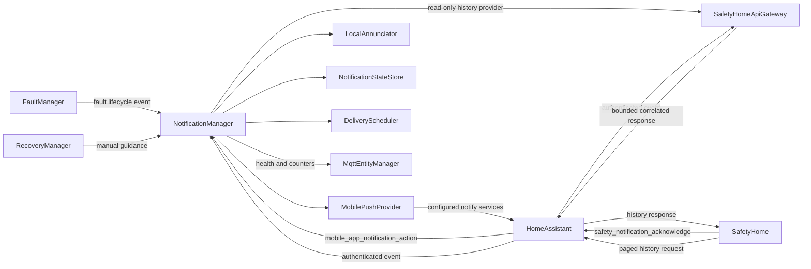

# Mobile Notification Delivery Architecture

## 1. Purpose

Mobile Notification Delivery converts fault lifecycle events into bounded,
traceable Home Assistant Companion notifications. The feature maintains one
logical notification per fault, delivers new alarms with a severity-specific
profile, refreshes active content quietly, and preserves delivery state across
AppDaemon reloads and restarts.

The delivery boundary is explicit: a successful Home Assistant service call
means **accepted by Home Assistant**. It does not prove that Firebase, Apple
Push Notification Service, or an individual phone delivered or displayed the
message. Diagnostics and logs shall not describe service acceptance as device
delivery.

## 2. Responsibilities

### 2.1 `NotificationManager`

- owns the active-notification lifecycle and stable fault tag;
- filters fault details through a configured allowlist before presentation;
- distinguishes a new alarm, quiet content refresh, controlled L1 repeat,
  friendly clear, and silent removal;
- treats a same-tag increase in urgency as a new alert, resetting its
  acknowledgement and L1 repeat policy where applicable;
- owns acknowledgement state without clearing the underlying fault;
- queues failed or WAN-blocked deliveries and applies retry policy;
- records deadline telemetry, transport results, and a bounded history of
  individual target submissions;
- persists all state needed to resume safely after a restart.

### 2.2 `MobilePushProvider`

- owns Home Assistant notify service names and Companion payload schemas;
- sends to every explicitly configured service;
- applies Android and iOS profiles for levels L1 through L3;
- uses iOS `time-sensitive` rather than `critical` by default for L1 so the
  stable-tag notification can still be replaced by quiet updates; an
  installation may opt into a critical sound profile when it accepts that
  platform limitation;
- sends the Companion command `message: clear_notification` with the stable
  tag when a notification must be removed;
- requests a Home Assistant service result with bounded AppDaemon and Home
  Assistant timeouts and reports each configured service as `accepted` or
  `failed`; a missing result is a retryable failure.

The provider shall never fall back to `notify.notify`. Installation routing
shall use an explicit group such as `notify/all_phones` or an explicit list of
mobile notify services.

### 2.3 `LocalAnnunciator`

- owns optional local alarm-panel and light actions;
- runs only for a newly active fault, not for quiet mobile refreshes;
- stores and restores the pre-alert light state where Home Assistant exposes
  enough state to do so;
- does not influence mobile transport success or retry decisions.

For internal environmental alarms, LocalAnnunciator shall apply the
[hazard-specific output contract](<Internal Environmental Hazard Monitoring - Architecture.md#7-guidance-and-output-safety>)
before activation, level changes and restoration. Severity alone shall not
authorize ordinary electrical switching during a flammable-gas incident.
Eligibility shall account for every active or unresolved gas incident, even
when another fault requests a light change. A rejected local output shall be
diagnosed without blocking mobile submission; autonomous detector alarms shall
remain independent. Returning a shared light to its previous state shall also
require current eligibility and shall not follow an old stored permission.
Gas switching inhibition shall be independently persisted and shall survive
detector HEAL until the reviewed installation clearance policy accepts explicit
authorized evidence. Notification acknowledgement or a `Cleared` fault event
shall not release this output restriction.

### 2.4 `NotificationStateStore`

- writes a versioned JSON snapshot atomically;
- restores active records, acknowledgements, pending deliveries, repeat state,
  counters, last transport result, and submission history;
- retains restored active records until a current fault event confirms SET,
  CLEARED, or SHADOWED, and reconciles an authoritative clear even when the
  fresh FaultManager lifecycle would otherwise suppress a duplicate clear;
- rejects malformed or unsupported snapshots without treating them as a
  positive delivery result;
- stores only filtered notification content, never the unfiltered fault event.

### 2.5 Delivery scheduler

- retries failed service submissions with bounded exponential backoff;
- keeps WAN-blocked items queued until the configured WAN entity recovers;
- performs controlled L1 repeats until acknowledgement or the configured
  repeat bound is reached;
- records whether Home Assistant accepted an attempt after its level deadline.

### 2.6 MQTT diagnostics

`sensor.notification_delivery_health` exposes transport health independently
from fault state. Its state is one of `healthy`, `degraded`, or `queued` and its
attributes include active/acknowledged/queued counts, accepted and failed
attempt counters, deadline misses, last attempt/result/error, per-service
status/time/error, and the explicit statement that device delivery is not
confirmed. `acknowledged_tags` lists stable tags for currently active,
acknowledged notifications so SafetyHome can retain button state after reload.

### 2.7 `SafetyHomeApiGateway`

`SafetyHomeApiGateway` is a read-only application-data boundary between the
AppDaemon backend and SafetyHome. It shall expose notification history through
the authenticated Home Assistant event connection without publishing the
journal in Home Assistant entity attributes. The gateway shall not expose
configuration read or write operations, notification routing changes, fault
state changes, or actuator commands.

SafetyHome requests a page by firing
`safetyhome_notification_history_request` with a correlation `request_id`, an
optional `cursor` and `revision`, and a requested `limit`. The gateway responds
on `safetyhome_notification_history_response`. The default page size is 20,
the maximum accepted size is 25, and the serialized response shall not exceed
12 KiB. Entries are ordered newest first. The revision identifies the newest
entry in the snapshot; a revision or cursor invalidated by a concurrent update
shall produce an explicit error instead of mixing snapshots.

These request and response event types transport application data rather than
audit evidence and shall be excluded from Home Assistant Recorder using the
installation fragment in
[`home_assistant_recorder_safetyhome_api.yaml`](../examples/home_assistant_recorder_safetyhome_api.yaml).
The retired `sensor.notification_history` MQTT discovery and retained state
shall be removed during startup migration.

### 2.8 Notification history

The manager shall retain the latest 100 individual target submission attempts,
including successful Home Assistant acceptance and failed submissions. Each
retry shall produce a separate entry only for the targets actually attempted.
Waiting for WAN recovery shall not create a submission-history entry.

The journal shall use the existing notification state snapshot and persistence
configuration. A compatible snapshot without history shall restore an empty
journal without discarding active or pending notification state.

Each entry shall contain:

| Field | Meaning |
| --- | --- |
| `id` | Unique UUID for this target attempt. |
| `tag` | Stable fault notification tag for correlation. |
| `kind`, `fault_state` | Submission purpose and associated fault lifecycle state. |
| `title`, `message` | Notification content, each bounded to 2048 characters. |
| `text_truncated` | Whether the stored title or message was shortened to its bound. |
| `level` | Notification severity level. |
| `created_at` | UTC ISO timestamp when this delivery was created. |
| `attempted_at` | UTC ISO timestamp recorded on completion of the submission attempt. |
| `attempt` | Attempt number within this delivery. |
| `service` | Actual configured Home Assistant notify service attempted. |
| `result` | `accepted_by_home_assistant` or `failed`. |
| `deadline_missed` | Whether this delivery exceeded its severity deadline. |

Kinds `new`, `update`, `repeat`, and `acknowledged` shall record `SET`;
`resolved` shall record `CLEARED`; `clear` shall record `SHADOWED`.
Acknowledgement therefore remains visibly distinct from healing. Shadowing
removes a notification and shall not be presented as a healed fault. The journal shall not expose raw
transport exception text, unfiltered fault events, or inferred group members.
Failure details in the history UI shall use a generic diagnostic explanation;
existing transport-health diagnostics retain their separate error contract.

The SafetyHome History page shall load the complete retained journal through
bounded gateway pages and present the notification list before entity history.
Each item shall show its date and time, lifecycle state, target service, and
submission outcome. Selecting it shall reveal its content and diagnostic
fields. Dates and times shall be presented in the browser's local time zone. A
notify group shall be identified by its configured service: the frontend shall
not infer which person or device received a group notification. Home Assistant
acceptance shall remain distinct from confirmed device delivery. A temporary
read-only fallback may consume the retired entity during migration, but no new
backend shall publish it.

## 3. Configuration contract

The installation config owns:

- `mobile.services`: explicit AppDaemon service names in `domain/service` form;
- `mobile.default_url`: Home Assistant-relative destination opened in the
  Companion app from the notification;
- optional WAN-state entity and its online states;
- optional local annunciator entities.

System configuration owns the bounded `mobile.hass_timeout_seconds`, severity
profiles, retry limits and backoff, L1 repeat policy, persistence path, and
additional-info allowlist. Runtime requires AppDaemon 4.5 or newer so
`return_result`, `timeout`, and `hass_timeout` are available.

The production default destination is `/5c36e1c9_hakit`; the relative path
keeps notification navigation inside the Companion app. The default transport is
`notify/all_phones`.

Default new-alert profiles are:

| Level | Android channel | Importance / priority | Vibration | iOS interruption |
| --- | --- | --- | --- | --- |
| L1 | `Safety critical` | `max` / `high`, TTL `0` | long urgent pattern | `time-sensitive` |
| L2 | `Safety hazards` | `high` / `high`, TTL `0` | shorter warning pattern | `time-sensitive` |
| L3 | `Safety warnings` | `default` / `normal`, TTL `0` | none | `active` |

Quiet updates, acknowledgement refreshes, and resolved messages override these alert properties with
Android `alert_once`/normal priority and iOS `passive` interruption.

## 4. Lifecycle

### 4.1 New active fault

1. Filter additional details.
2. Build localized content and acknowledgement action.
3. Persist the active record before attempting an external call.
4. Run optional local annunciators once, before any blocking remote submission.
5. If WAN is explicitly offline, queue the attempt.
6. Otherwise submit to every configured mobile service.
7. Record acceptance/failure and deadline telemetry.
8. Schedule bounded L1 repeats when applicable.

### 4.2 Active content refresh

A repeated `SET` or newly discovered recovery guidance updates the same tag.
The refresh uses a quiet profile and shall not re-run local annunciators. On
Android it uses `alert_once`; on iOS it uses a passive interruption profile.
If the new-alert attempt is still pending for any target, its content is
updated without downgrading it to quiet; only targets that already completed
the new-alert submission receive the quiet refresh.

### 4.3 Acknowledgement

The Companion action identifier contains the stable fault tag. A matching
`mobile_app_notification_action` event, or an authenticated SafetyHome
`safety_notification_acknowledge` event carrying that exact tag, marks the
active record acknowledged. The manager persists it, cancels all superseded
pending submissions for that tag, and quietly replaces the phone notification
without the acknowledgement action. The acknowledgement submission is retained
in notification history. Acknowledgement shall not clear the fault and shall not
prevent later quiet content refreshes. SafetyHome reads the tag from the active
fault entity and the acknowledgement state from notification diagnostics.

### 4.4 Fault clear and shadow

A cleared fault publishes a friendly resolved message with a dedicated
localized clear title and the same tag, then removes the active record. A
shadowed fault sends the Companion
`clear_notification` command with the same tag. Pending attempts and scheduled
repeats for that tag are removed in both cases.

## 5. Failure behavior

- Failure of one configured target shall not prevent attempts to other targets.
- A partial target failure is `degraded`, not `healthy`.
- Exhausted retry attempts remain visible in diagnostics and logs.
- WAN state that is missing, unknown, or unavailable shall not be interpreted
  as confirmed connectivity. New remote deliveries remain queued until the
  state becomes one of the configured online states.
- Mobile transport failure shall not block FaultManager, recovery policy, MQTT
  fault state, or local annunciators.
- A newer lifecycle state or content update for a stable tag shall replace
  superseded queued submissions for that tag. A retry shall never restore older
  notification content or a previous resolved state.

## 6. Verification contract

Automated tests shall cover exact L1-L3 new and quiet payloads, explicit target
routing, correct clear commands, partial failures, retry bounds, WAN queue and
flush, deadlines, acknowledgement, controlled repeats, restart restoration,
allowlist filtering, local-annunciator separation, and diagnostic publication.
History tests shall cover SET and CLEARED entries, distinct shadow removal,
per-target failures and retries, retention bounds, restart restoration,
compatible snapshots without history, and content bounds. Gateway tests shall
cover correlation, newest-first pagination, snapshot revision, invalid or
stale cursors, response-size bounds, listener lifecycle, and removal of the
retired MQTT entity. Retry tests shall cover failed acknowledgement followed
by newer content and a new SET following a failed resolved submission.
Frontend domain and component tests shall cover request and response contracts,
lifecycle labels, filtering, date/time, target presentation, diagnostic
details, refresh, and empty or unavailable history.

Live verification shall not trigger a household fault, siren, warning light,
or unsolicited phone notification. Production delivery requires a separately
approved controlled test.
