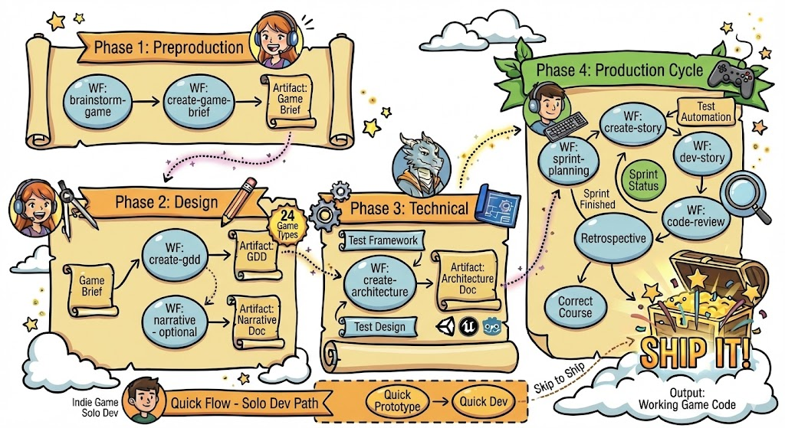

# BMGD Quick Start Guide

Get started building games with the BMad Game Development Module.

---

## Prerequisites

Before starting with BMGD, ensure you have:

1. **BMAD-METHOD installed** - Follow the main installation guide
2. **A game idea** - Even a rough concept is enough to start
3. **Your preferred AI tool** - Claude Code, Cursor, or web-based chat

---

## Installation

BMGD is a custom module that extends BMM. Install it using the BMAD installer:

```bash
# During installation, select BMGD when prompted for custom modules
npx bmad-cli install
```

Or add to an existing installation:

```bash
npx bmad-cli install --add-module bmgd
```

---

## Understanding the Phases

BMGD follows four game development phases:



### Phase 1: Preproduction

**What happens:** Capture your game vision and core concept.

**Workflows:**

- `brainstorm-game` - Guided ideation with game-specific techniques
- `create-game-brief` - Document vision, market, pillars, and fundamentals

**Output:** Game Brief document

### Phase 2: Design

**What happens:** Detail your game's mechanics, systems, and (optionally) narrative.

**Workflows:**

- `create-gdd` - Create comprehensive Game Design Document
- `narrative` - Create Narrative Design Document (for story-driven games)

**Output:** GDD (and Narrative Design document if applicable)

### Phase 3: Technical

**What happens:** Plan how you'll build the game.

**Workflows:**

- `create-architecture` - Define engine, systems, patterns, and structure

**Output:** Game Architecture document

### Phase 4: Production

**What happens:** Build your game in sprints.

**Workflows:**

- `sprint-planning` - Plan and track sprints
- `sprint-status` - View progress and get recommendations
- `create-story` - Create implementable stories
- `dev-story` - Implement stories
- `code-review` - Quality assurance
- `retrospective` - Learn and improve after epics

**Output:** Working game code

---

## Your First Game Project

### Step 1: Start with Brainstorming (Optional)

If you have a vague idea and want help developing it:

```
You: brainstorm-game
Agent: [Guides you through game-specific ideation techniques]
```

### Step 2: Create Your Game Brief

Capture your game's core vision:

```
You: create-game-brief
Agent: [Walks you through game concept, pillars, market, and fundamentals]
```

**Output:** `{output_folder}/game-brief.md`

### Step 3: Create Your GDD

Detail your game's design:

```
You: create-gdd
Agent: [Guides you through mechanics, systems, and game-type-specific sections]
```

**Output:** `{output_folder}/gdd.md` (or sharded into `{output_folder}/gdd/`)

### Step 4: Add Narrative Design (If Story-Driven)

For games with significant story:

```
You: narrative
Agent: [Facilitates story, characters, world, and dialogue design]
```

**Output:** `{output_folder}/narrative-design.md`

### Step 5: Create Architecture

Plan your technical implementation:

```
You: create-architecture
Agent: [Guides engine selection, system design, and technical decisions]
```

**Output:** `{output_folder}/game-architecture.md`

### Step 6: Start Building

Begin sprint-based development:

```
You: sprint-planning
Agent: [Sets up sprint tracking and epic management]
```

---

## Choosing Your Agent

BMGD provides six specialized agents:

| Agent                 | Icon | When to Use                               |
| --------------------- | ---- | ----------------------------------------- |
| **Game Designer**     | 🎲   | Brainstorming, Game Brief, GDD, Narrative |
| **Game Architect**    | 🏛️   | Architecture, technical decisions         |
| **Game Developer**    | 🕹️   | Implementation, code reviews              |
| **Game Scrum Master** | 🎯   | Sprint planning, story management         |
| **Game QA**           | 🧪   | Test framework, test design, automation   |
| **Game Solo Dev**     | 🎮   | Quick prototyping, indie development      |

### Typical Flow

1. **Game Designer** (Phases 1-2): Brainstorm → Brief → GDD → Narrative
2. **Game Architect** (Phase 3): Architecture
3. **Game Scrum Master** (Phase 4): Sprint planning, story creation
4. **Game Developer** (Phase 4): Implementation, code reviews

---

## Quick Command Reference

### Phase 1: Preproduction

- `brainstorm-game` - Ideation session
- `create-game-brief` - Create Game Brief

### Phase 2: Design

- `create-gdd` - Create GDD
- `narrative` - Create Narrative Design

### Phase 3: Technical

- `create-architecture` - Create Architecture

### Phase 4: Production

- `sprint-planning` - Plan sprints
- `sprint-status` - View progress and recommendations
- `create-story` - Create story
- `dev-story` - Implement story
- `code-review` - Review code
- `retrospective` - Team retrospective
- `correct-course` - Handle sprint changes

### Quick-Flow (Fast-Track)

- `quick-prototype` - Rapid prototyping (IDE only)
- `quick-dev` - Flexible development (IDE only)

### Utility

- `workflow-status` - Check project status
- `party-mode` - Multi-agent collaboration
- `advanced-elicitation` - Deep exploration

---

## Tips for Success

### 1. Start Small

Begin with a simple game concept. You can always expand later.

### 2. Use Game Type Templates

When creating your GDD, BMGD offers 24 game type templates that provide genre-specific sections.

### 3. Iterate

Documents are living artifacts. Return to update them as your vision evolves.

### 4. Trust the Process

Each workflow builds on previous outputs. The Game Brief informs the GDD, which informs the Architecture, which informs implementation.

### 5. Collaborate with Agents

Use `party-mode` to get perspectives from multiple agents when facing complex decisions.

---

## Next Steps

- **[Agents Guide](./agents-guide.md)** - Learn about each agent's capabilities
- **[Workflows Guide](./workflows-guide.md)** - Detailed workflow reference
- **[Quick-Flow Guide](./quick-flow-guide.md)** - Rapid prototyping and development
- **[Game Types Guide](./game-types-guide.md)** - Understand game type templates
- **[Glossary](./glossary.md)** - Game development terminology

---

**Ready to start?** Chat with the **Game Designer** agent and say `brainstorm-game` or `create-game-brief`!
